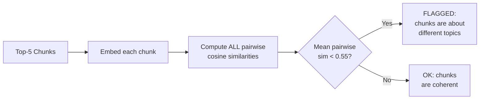
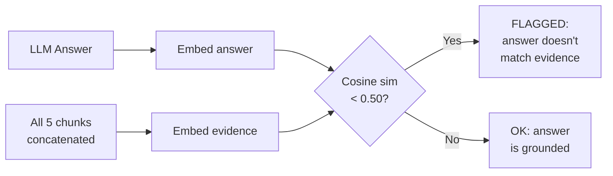
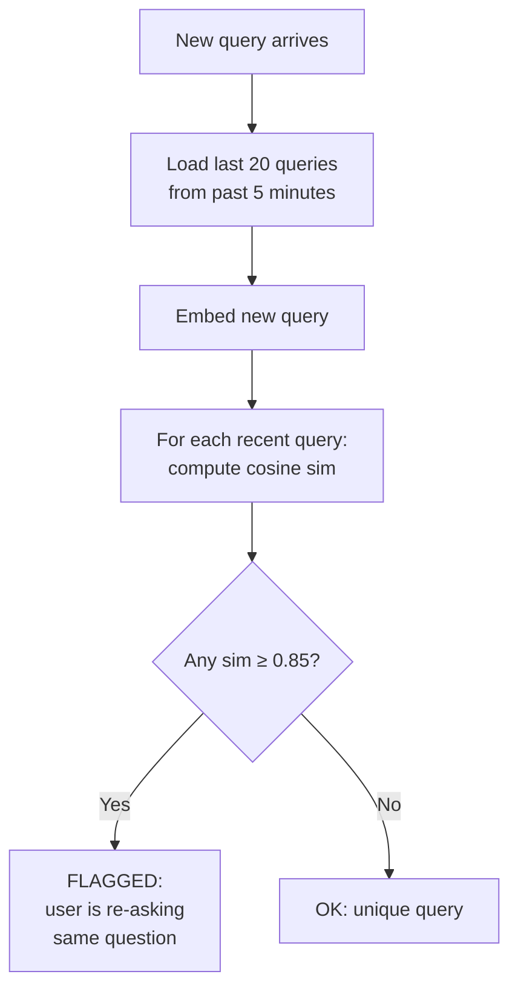
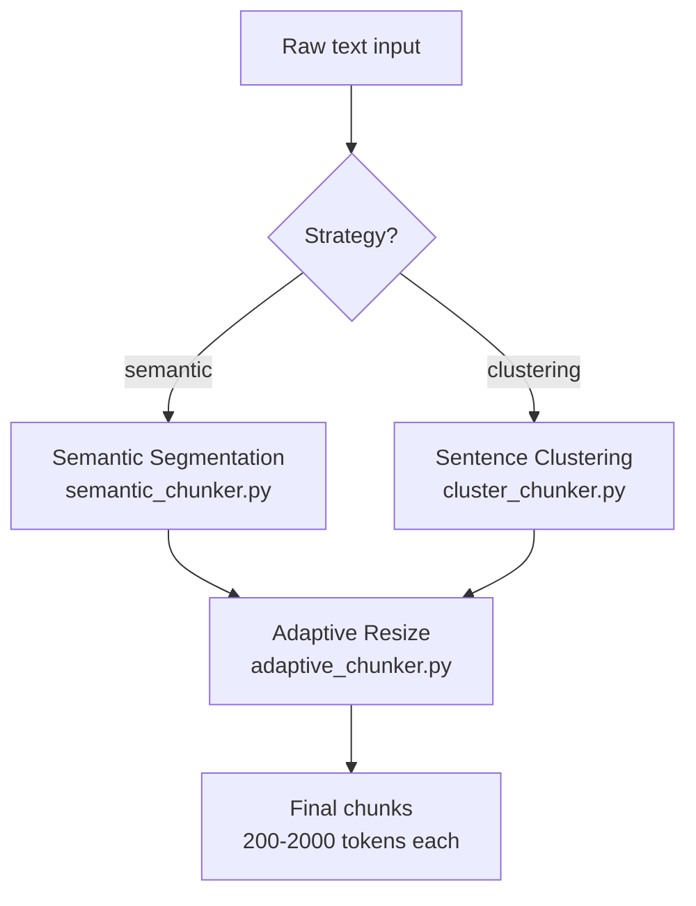

# Month 2 & 3 — Detailed Technical Explanation

---

## Month 2 — Low Recall Detector Prototype

### Where it lives
- [detector/detectors.py](file:///c:/Users/hegde/Desktop/Self-Oragnising-RAG/detector/detectors.py) — All 6 detection rules

### When does it run?

Every time a user sends a query, this happens in [retrieval.py](file:///c:/Users/hegde/Desktop/Self-Oragnising-RAG/controllers/retrieval.py):

```
User sends query
    → Pinecone retrieves top-5 chunks with scores
    → LLM generates answer from those chunks
    → log_query() saves everything to SQLite (query, scores, answer, chunks)
    → run_detectors(log_id) ← THIS fires all 6 rules silently
```

The key line is [Line 42](file:///c:/Users/hegde/Desktop/Self-Oragnising-RAG/controllers/retrieval.py#L42):
```python
run_detectors(log_id)   # fires silently, never blocks the response
```

The detectors never block the API response — if they crash, the user still gets their answer.

---

### Rule 1: `low_top_score` (Threshold-based)

**File:** [detectors.py L148-150](file:///c:/Users/hegde/Desktop/Self-Oragnising-RAG/detector/detectors.py#L148-L150)

```python
if scores and scores[0] < SCORE_LOW:    # SCORE_LOW = 0.45
    triggered.append("low_top_score")
```

**What it does:** Checks if the best retrieved chunk's cosine similarity score is below 0.45.

**Why:** When Pinecone returns the top-5 chunks, each has a similarity score (0 to 1). If even the best match is below 0.45, the system has no relevant content for this query — the answer will likely be poor or hallucinated.

**Example:**
- Query: "What is quantum physics?" → scores: `[0.32, 0.28, 0.25, 0.22, 0.20]`
- Top score `0.32 < 0.45` → **FLAGGED**

---

### Rule 2: `score_drop` (Threshold-based)

**File:** [detectors.py L152-154](file:///c:/Users/hegde/Desktop/Self-Oragnising-RAG/detector/detectors.py#L152-L154)

```python
if len(scores) >= 2 and (scores[0] - scores[-1]) > SCORE_DROP:  # SCORE_DROP = 0.3
    triggered.append("score_drop")
```

**What it does:** Checks if there's a large gap between the best chunk and the worst chunk in the top-5.

**Why:** If chunk #1 scores 0.85 but chunk #5 scores 0.40, that's a 0.45 gap. This means the system only found 1 truly relevant chunk and padded the rest with junk. The LLM gets confused by the irrelevant chunks mixed in with the good one.

**Example:**
- Scores: `[0.82, 0.55, 0.48, 0.44, 0.41]` → gap = `0.82 - 0.41 = 0.41 > 0.3` → **FLAGGED**

---

### Rule 3: `llm_uncertainty` (Keyword-based)

**File:** [detectors.py L156-158](file:///c:/Users/hegde/Desktop/Self-Oragnising-RAG/detector/detectors.py#L156-L158)

```python
if any(phrase in response for phrase in UNCERTAINTY_PHRASES):
    triggered.append("llm_uncertainty")
```

**What it does:** Scans the LLM's answer for hedging phrases like "I don't know", "no information", "unclear", etc.

**Why:** When the LLM receives poor context, it often hedges instead of giving a confident answer. These phrases are a direct signal that the retrieval failed — the LLM itself is telling us it doesn't have enough information.

**Phrases checked (12 total):**
```python
["i don't know", "i'm not sure", "cannot find", "no information",
 "not available", "i cannot", "unclear", "no relevant", "don't have",
 "unable to find", "no context", "not enough information"]
```

---

### Rule 4: `semantic_mismatch` (Embedding-based) ← Month 2 NEW

**File:** [detectors.py L52-73](file:///c:/Users/hegde/Desktop/Self-Oragnising-RAG/detector/detectors.py#L52-L73)

**Algorithm:**



**Step by step:**
1. Take the 5 retrieved chunk texts
2. Embed each one using `mxbai-embed-large` → 5 vectors of 1024 dimensions
3. Compute cosine similarity between every pair: (1,2), (1,3), (1,4), (1,5), (2,3), (2,4), (2,5), (3,4), (3,5), (4,5) = **10 pairs**
4. Calculate the mean of all 10 similarities
5. If mean < 0.55 → the chunks are about different topics → **FLAGGED**

**Why:** If you ask "What is binary search?" and the system returns:
- Chunk 1: about binary search ✓
- Chunk 2: about hash tables ✗
- Chunk 3: about networking ✗
- Chunk 4: about binary search ✓
- Chunk 5: about databases ✗

These chunks are semantically fragmented — the LLM receives contradictory context and produces a confused answer. The pairwise similarity between "binary search" and "networking" is low, dragging the mean down.

**Code:**
```python
embeddings = [np.array(emb_model.embed_query(c[:500])) for c in chunks]
sims = []
for i in range(len(embeddings)):
    for j in range(i + 1, len(embeddings)):
        sims.append(_cosine_sim(embeddings[i], embeddings[j]))
mean_sim = np.mean(sims)
return float(mean_sim) < CHUNK_COHERENCE  # 0.55
```

---

### Rule 5: `evidence_mismatch` (Embedding-based) ← Month 2 NEW

**File:** [detectors.py L76-94](file:///c:/Users/hegde/Desktop/Self-Oragnising-RAG/detector/detectors.py#L76-L94)

**Algorithm:**



**Step by step:**
1. Take the LLM's generated answer → embed it (1024-dim vector)
2. Concatenate all 5 retrieved chunks into one text → embed it (1024-dim vector)
3. Compute cosine similarity between the answer embedding and the evidence embedding
4. If similarity < 0.50 → the answer is NOT grounded in the evidence → **FLAGGED**

**Why:** This detects **hallucination**. If the LLM ignores the retrieved context and answers from its own training data, the answer will be semantically different from the evidence. For example:
- Evidence chunks: about "sorting algorithms in Python"
- LLM answer: talks about "machine learning architectures"
- These are semantically far apart → evidence mismatch detected

**Code:**
```python
answer_emb = np.array(emb_model.embed_query(answer[:500]))
evidence_text = " ".join(chunks)[:1000]
evidence_emb = np.array(emb_model.embed_query(evidence_text))
sim = _cosine_sim(answer_emb, evidence_emb)
return sim < EVIDENCE_MATCH  # 0.50
```

---

### Rule 6: `user_frustration` (Behavioral) ← Month 2 NEW

**File:** [detectors.py L97-124](file:///c:/Users/hegde/Desktop/Self-Oragnising-RAG/detector/detectors.py#L97-L124)

**Algorithm:**



**Step by step:**
1. User sends a query
2. Load the last 20 queries from the past 5 minutes (300 seconds) from SQLite
3. Embed the new query using `mxbai-embed-large`
4. For each recent query, embed it and compute cosine similarity with the new query
5. If any similarity ≥ 0.85 → the user is rephrasing the same question → **FLAGGED**

**Why:** When users are unsatisfied, they rephrase their question. "What is binary search?" → "Tell me about binary search" → "How does binary search work?". These are semantically near-identical (cosine sim > 0.85). Detecting this pattern means the system failed the user on the first attempt.

**Code:**
```python
cutoff = datetime.utcnow() - timedelta(seconds=300)
recent = session.query(QueryLog).filter(QueryLog.timestamp >= cutoff)...
for row in recent[1:]:  # skip current query
    prev_emb = np.array(emb_model.embed_query(row.query[:500]))
    sim = _cosine_sim(query_emb, prev_emb)
    if sim >= 0.85:
        return True  # frustration detected
```

---

### How events are created

When ANY rule triggers, a `LowRecallEvent` is written to SQLite ([detectors.py L172-186](file:///c:/Users/hegde/Desktop/Self-Oragnising-RAG/detector/detectors.py#L172-L186)):

```python
severity = {1: "LOW", 2: "MEDIUM"}.get(len(triggered), "HIGH")
# 1 rule fires → LOW
# 2 rules fire → MEDIUM  
# 3+ rules fire → HIGH

event = LowRecallEvent(
    query_log_id        = log.id,
    triggered_detectors = json.dumps(triggered),  # e.g. ["semantic_mismatch", "user_frustration"]
    severity            = severity,
)
log.flagged = True  # marks the query as flagged in the dashboard
```

These events are visible at:
- **API:** `GET /api/v1/events`
- **Dashboard:** Low-Recall Events page

---

---

## Month 3 — Auto Chunker v1

### Where it lives

```
auto_chunker/
├── semantic_chunker.py    ← Strategy 1: embedding boundary detection
├── cluster_chunker.py     ← Strategy 2: agglomerative clustering
├── adaptive_chunker.py    ← Post-processor: enforces 200–2000 token range
└── pipeline.py            ← Orchestrator: chains everything together
```

### The pipeline flow



---

### Strategy 1: Semantic Segmentation

**File:** [semantic_chunker.py](file:///c:/Users/hegde/Desktop/Self-Oragnising-RAG/auto_chunker/semantic_chunker.py)

**Core idea:** Split text where the **topic changes**. Detect topic changes by measuring embedding similarity between consecutive sentences.

**Algorithm:**

```
Input: "Machine learning uses data. It learns patterns. Binary search divides lists. It finds items fast."

Step 1: Split into sentences
  S1: "Machine learning uses data."
  S2: "It learns patterns."
  S3: "Binary search divides lists."
  S4: "It finds items fast."

Step 2: Embed each sentence → 1024-dim vectors
  E1: [0.23, 0.45, ...] (ML-related direction)
  E2: [0.25, 0.44, ...] (ML-related direction)
  E3: [0.71, 0.12, ...] (search-related direction)
  E4: [0.69, 0.14, ...] (search-related direction)

Step 3: Cosine similarity between consecutive pairs
  sim(E1, E2) = 0.92  ← same topic (ML)
  sim(E2, E3) = 0.38  ← TOPIC CHANGE! (ML → search) ← below threshold 0.65
  sim(E3, E4) = 0.89  ← same topic (search)

Step 4: Split at boundaries where sim < 0.65
  Chunk 1: "Machine learning uses data. It learns patterns."
  Chunk 2: "Binary search divides lists. It finds items fast."
```

**Why this approach:** Traditional chunkers (like RecursiveCharacterTextSplitter) split purely by character count — they might cut a paragraph about ML in half and merge the second half with a paragraph about databases. Semantic segmentation preserves topic coherence because it only splits where the meaning actually changes.

**Key code** ([L58-63](file:///c:/Users/hegde/Desktop/Self-Oragnising-RAG/auto_chunker/semantic_chunker.py#L58-L63)):
```python
boundaries = []
for i in range(len(embeddings) - 1):
    sim = _cosine_sim(embeddings[i], embeddings[i + 1])
    if sim < similarity_threshold:  # 0.65
        boundaries.append(i + 1)    # mark boundary AFTER this sentence
```

---

### Strategy 2: Sentence Similarity Clustering

**File:** [cluster_chunker.py](file:///c:/Users/hegde/Desktop/Self-Oragnising-RAG/auto_chunker/cluster_chunker.py)

**Core idea:** Group sentences that are **about the same topic**, even if they're not adjacent in the document.

**Algorithm:**

```
Input: "ML uses data. Binary search is fast. ML learns patterns. Search divides lists."

Step 1: Split into sentences & embed
  S1: "ML uses data."           → E1
  S2: "Binary search is fast."  → E2
  S3: "ML learns patterns."     → E3
  S4: "Search divides lists."   → E4

Step 2: Compute ALL pairwise cosine distances
         S1    S2    S3    S4
  S1   [0.00, 0.62, 0.08, 0.59]   ← S1↔S3 very close (both ML)
  S2   [0.62, 0.00, 0.58, 0.11]   ← S2↔S4 very close (both search)
  S3   [0.08, 0.58, 0.00, 0.55]
  S4   [0.59, 0.11, 0.55, 0.00]

Step 3: Agglomerative clustering (distance_threshold=0.5)
  Cluster A: S1, S3  (both ML-related, distance 0.08)
  Cluster B: S2, S4  (both search-related, distance 0.11)

Step 4: Reassemble in original document order
  Chunk 1 (Cluster A): "ML uses data. ML learns patterns."
  Chunk 2 (Cluster B): "Binary search is fast. Search divides lists."
```

**Why this approach:** Unlike semantic segmentation (which only looks at consecutive sentences), clustering can group sentences that are far apart in the document but about the same topic. This is powerful for documents where topics are interleaved — e.g., a Q&A document where the same topic appears in multiple places.

**Key code** ([L56-67](file:///c:/Users/hegde/Desktop/Self-Oragnising-RAG/auto_chunker/cluster_chunker.py#L56-L67)):
```python
dist_matrix = cosine_distances(embeddings)           # NxN distance matrix
clustering = AgglomerativeClustering(
    n_clusters=None,                                  # auto-determine
    distance_threshold=0.5,                           # merge if distance < 0.5
    metric="precomputed",                             # we provide the distance matrix
    linkage="average",                                # average-link merging
)
labels = clustering.fit_predict(dist_matrix)          # [0, 1, 0, 1] → cluster labels
```

**Why agglomerative clustering:** It's hierarchical (bottom-up), so it naturally handles documents of any size. And `distance_threshold` lets us control granularity without fixing the number of clusters in advance.

---

### Adaptive Chunk Sizing (Post-processor)

**File:** [adaptive_chunker.py](file:///c:/Users/hegde/Desktop/Self-Oragnising-RAG/auto_chunker/adaptive_chunker.py)

**Problem:** After semantic segmentation or clustering, some chunks may be tiny (1 sentence = 50 tokens) or huge (entire section = 5000 tokens). The embedding model works best with **200–2000 tokens**.

**Two-pass algorithm:**

```
Pass 1 — MERGE small chunks (< 200 tokens):
  [50 tokens] + [80 tokens] + [150 tokens] → [280 tokens] ✓

Pass 2 — SPLIT large chunks (> 2000 tokens):
  [3500 tokens] → split at sentence boundaries → [1800 tokens] + [1700 tokens] ✓
```

**Token estimation:** `tokens ≈ len(text) / 4` (approximately 4 characters per English token)

**Why:** 
- Too-small chunks lose context — "It uses data" means nothing without knowing what "it" refers to
- Too-large chunks dilute the signal — the embedding averages over too many topics, reducing retrieval precision
- 200–2000 is the sweet spot for `mxbai-embed-large` (max 512 tokens ≈ 2048 chars)

**Key code — merging** ([L50-68](file:///c:/Users/hegde/Desktop/Self-Oragnising-RAG/auto_chunker/adaptive_chunker.py#L50-L68)):
```python
if buf_tokens < MIN_TOKENS:  # 200
    # Merge: concatenate with next chunk
    buffer = Document(
        page_content=buffer.page_content + " " + chunk.page_content,
        metadata={**buffer.metadata, "resized": True},
    )
```

**Key code — splitting** ([L78-93](file:///c:/Users/hegde/Desktop/Self-Oragnising-RAG/auto_chunker/adaptive_chunker.py#L78-L93)):
```python
for sent in sentences:
    if current_len + sent_tokens > MAX_TOKENS and current_parts:  # 2000
        final.append(Document(page_content=" ".join(current_parts), ...))
        current_parts = []  # start new chunk
    current_parts.append(sent)
```

---

### Pipeline Orchestrator

**File:** [pipeline.py](file:///c:/Users/hegde/Desktop/Self-Oragnising-RAG/auto_chunker/pipeline.py)

Chains everything together:
```python
def auto_chunk(text, source, strategy="semantic"):
    # Step 1: Segment
    if strategy == "clustering":
        raw_chunks = chunk_by_clustering(text, source)
    else:
        raw_chunks = chunk_by_semantic_segmentation(text, source)

    # Step 2: Enforce size limits
    final_chunks = adaptive_resize(raw_chunks)
    return final_chunks
```

**API endpoint:** `POST /api/v1/auto-chunk` in [routes.py L46-65](file:///c:/Users/hegde/Desktop/Self-Oragnising-RAG/api/routes.py#L46-L65)

---

## Summary: Why Each Component Exists

| Component | Problem it solves |
|-----------|------------------|
| `low_top_score` | No relevant content exists for this query |
| `score_drop` | Only 1 good chunk found, rest is noise |
| `llm_uncertainty` | LLM itself admits it can't answer |
| `semantic_mismatch` | Retrieved chunks are about different topics → confused LLM |
| `evidence_mismatch` | LLM hallucinated instead of using the evidence |
| `user_frustration` | User is unhappy, re-asking the same thing |
| Semantic chunking | Split at topic boundaries, not arbitrary char counts |
| Clustering chunking | Group related sentences even if they're far apart |
| Adaptive sizing | Keep chunks in the embedding model's optimal range |
