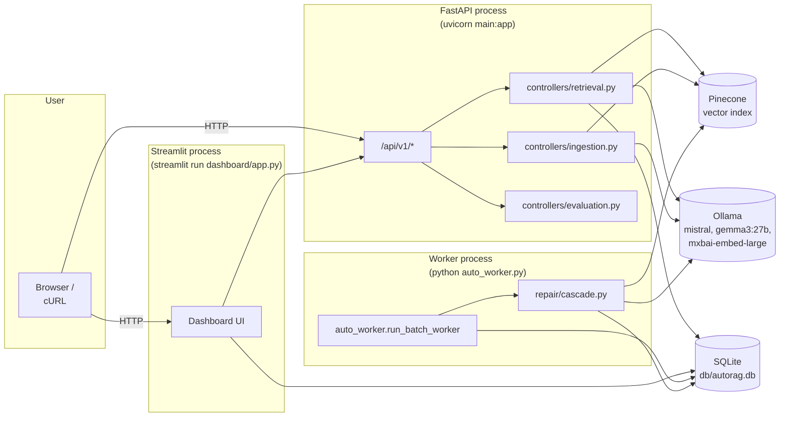
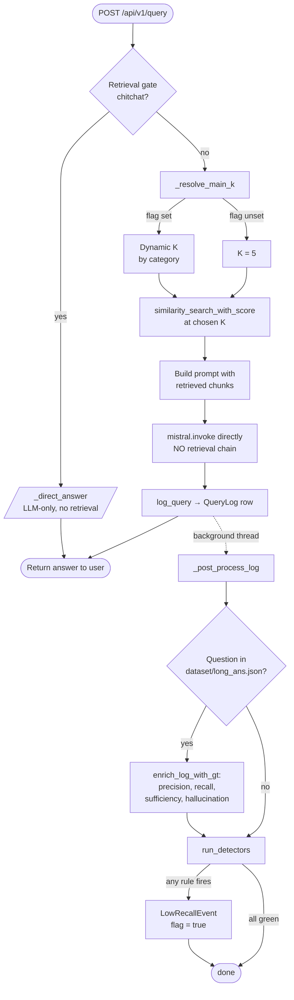
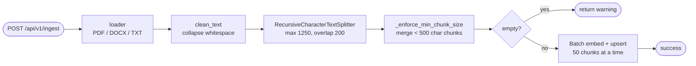
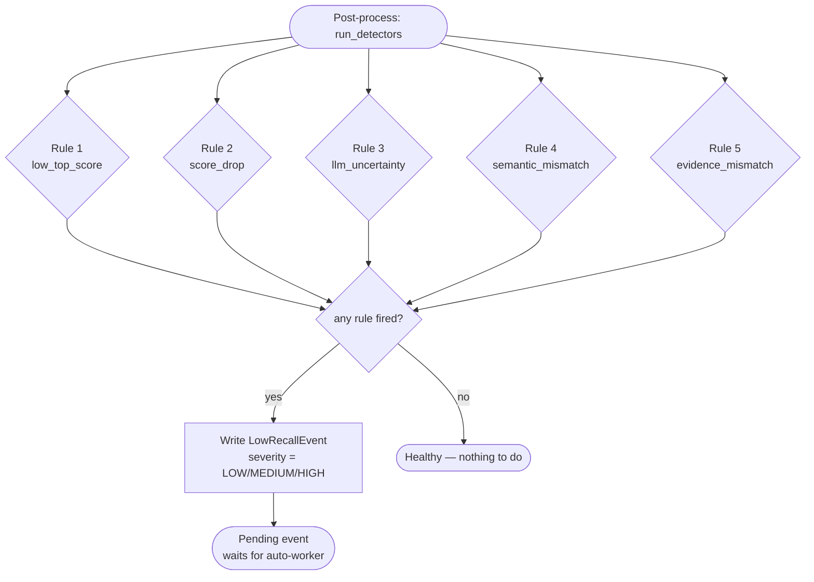
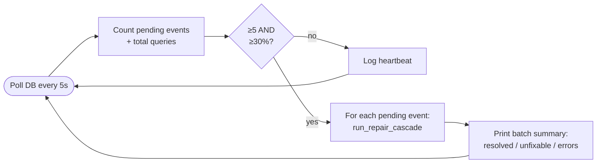
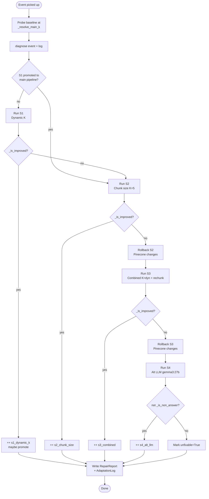
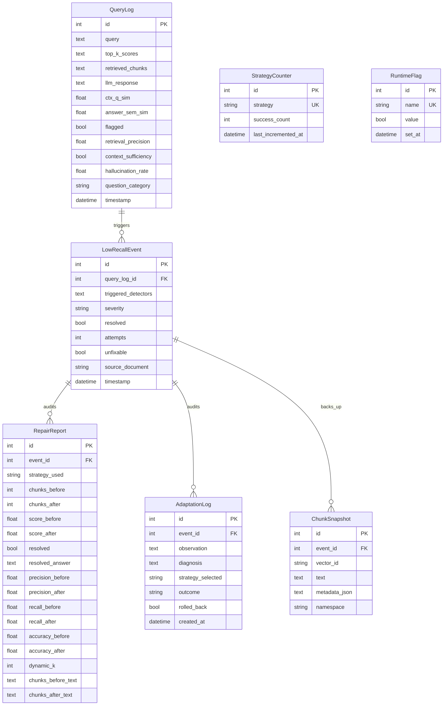

# Self-Organising RAG — Complete System Explanation

A self-healing Retrieval-Augmented Generation (RAG) system that automatically
detects, diagnoses, and repairs poor retrieval quality without human
intervention. The system ingests documents into Pinecone, answers questions
using Ollama + retrieved chunks, monitors its own answers via 5 detection
rules, and runs a **single-pass 4-strategy repair cascade** when failures
accumulate. Successful repair strategies can be **promoted** into the main
query pipeline.

This document covers everything: architecture, every module, the cascade
mechanics, optimization decisions, and the end-to-end flow.

---

## 1. Process Model

Three independent OS processes share one SQLite database and one Pinecone
index. The DB is the queue between them — no process talks to another
directly.



**Why three processes?** The repair cascade is slow (rechunk + re-embed +
LLM probes), so it must not block the user's request path. The auto-worker
polls SQLite every 5s and runs the cascade when the failure threshold is
met. `main.py` explicitly *disables* the in-process repair loop with a
comment block to prevent double-processing.

---

## 2. Tech Stack

| Layer | Technology |
|---|---|
| HTTP API | FastAPI |
| Primary LLM | Ollama — `mistral` (7B) |
| Fallback LLM | Ollama — `gemma3:27b` |
| Embeddings | Ollama — `mxbai-embed-large` (1024-dim) |
| Vector store | Pinecone |
| Persistence | SQLite via SQLAlchemy |
| Dashboard | Streamlit |
| Glue | LangChain primitives (cached singletons in `services/llm_factory.py`) |

All configuration flows through `config.py` (pydantic-settings, reads `.env`).
Code imports `from config import settings` rather than reading env vars
directly. Key settings: `pinecone_*`, `llm_model_name`, `fallback_llm_model`,
`embedding_model_name`, `ollama_base_url`, `gt_dataset_path`.

---

## 3. Query Pipeline — End-to-End

The full lifecycle of one user query, from HTTP request to the answer the
dashboard eventually shows.



The dashed line is critical: **`_post_process_log` runs on a daemon thread**.
The HTTP response returns immediately after `log_query` writes the row.
GT enrichment (~600ms of embeddings) and detection (~300ms of embeddings)
happen in the background. The dashboard sees the row populate over 0.5–1.5s
after the answer appears.

### 3.1 Retrieval Gate (`organiser/retrieval_gate.py`)

A two-tier check that decides whether the query needs the document store at
all. "Hello", "thanks", "what's up" never touch Pinecone — they get a
direct LLM response oriented around document Q&A.

- **Tier 1**: exact-match against a small chitchat list (`hi`, `hello`,
  `thanks`, `ok`, `yes`, etc.) — instant.
- **Tier 2**: mistral classifies the query as RETRIEVE vs DIRECT. ~1.5s
  added latency for ambiguous queries.

Falls back to RETRIEVE on any failure (fail-safe). Returns
`{needs_retrieval, reason, gate_detail}` always — even the fallback dict
now carries `gate_detail` for downstream consistency.

### 3.2 Dynamic K Resolution (`controllers/retrieval._resolve_main_k`)

Reads `RuntimeFlag("dynamic_k_promoted")` from SQLite on every request:

- **Not promoted (default)**: returns 5
- **Promoted**: classifies the query and returns a category-appropriate K

| Category | K range | Why |
|---|---|---|
| `short_factual` | 2–4 | Tight, focused retrieval |
| `complex` | 5–8 | Need more context |
| `cross_section` | 6–10 | Span multiple topics |

Promotion happens once `s1_dynamic_k` strategy accumulates 5 successes
(see §6.4). One-way — never demoted.

### 3.3 Answer Generation — Single LLM Call

Earlier the code used `create_retrieval_chain` + `create_stuff_documents_chain`,
which **re-embedded the query and re-queried Pinecone** internally.
Removed during the latency-optimization pass. The pipeline now does:

1. Embed query (once)
2. Pinecone search at chosen K (once)
3. Build prompt from retrieved doc content directly
4. `llm.invoke(prompt)` — single inference call
5. Return `answer.content.strip()`

Saves ~280ms per query.

### 3.4 Ground-Truth Enrichment (`controllers/gt_lookup.py`)

Loads `dataset/long_ans.json` (path configurable via
`settings.gt_dataset_path`) into an in-memory dict on first call, keyed by
normalized question text. When a user types a question that matches a
known entry:

- `lookup_ground_truth(query)` returns the `ans` list
- `enrich_log_with_gt(log_id, query, answer, contexts, gts)` computes the
  same metrics that `/evaluate-local` computes per-batch:
  - `answer_sem_sim` — max cosine similarity of answer vs any GT
  - `ctx_q_sim` — average context↔question similarity
  - `retrieval_precision_at_k`
  - `context_sufficiency` (Boolean)
  - `hallucination_rate`
  - `question_category`

Persisted via `update_log_eval_metrics` + `update_log_new_metrics`. The
dashboard's `ANSWER↔GT` column now populates immediately for any
dataset-matched query.

**Cache + safety details:**
- Thread-safe via `threading.Lock` with double-checked init
- Duplicate questions in the dataset are merged + deduped, not overwritten
- Path is `os.path.normpath`-resolved so error messages stay readable
- Falls back to no-GT path silently on any failure

---

## 4. Document Ingestion



| Parameter | Value | Why |
|---|---|---|
| `CHUNK_SIZE` | 1250 chars | Upper bound of recursive splitter |
| `MIN_CHUNK_SIZE` | 500 chars | Tiny chunks dilute embedding meaning |
| `CHUNK_OVERLAP` | 200 chars | 16% — keeps context across boundaries |
| `SEPARATORS` | `\n\n` → `\n` → `. ` → `? ` → `! ` → `; ` → `, ` → ` ` → `""` | Recursive splitter falls down the hierarchy |

The min-size enforcement does a forward-merge pass: keep concatenating
small chunks into a buffer until the buffer is ≥ 500. The trailing buffer
back-merges into the previous chunk if it's still too small.

**Empty-input guard:** if the document produces zero chunks (extracted
text was empty / all whitespace), the endpoint returns
`{"status": "warning", "message": "No chunks produced — document may be empty"}`
instead of crashing on `min([])`.

There's also a smaller standalone helper `add_chunks/add_chunk(text, source)`
exposed via `/api/v1/add-chunks` for ad-hoc text chunking from the dashboard.
The endpoint delegates to the same helper — no duplicated splitter logic.

---

## 5. Detection — Stage 1

`detector/detectors.py` runs **5 independent rules** after every query.
If any rule fires, a `LowRecallEvent` is written and `QueryLog.flagged = True`.



| # | Rule | What it catches | Threshold |
|---|---|---|---|
| 1 | `low_top_score` | Top-1 chunk score below floor | `< 0.65` |
| 2 | `score_drop` | Score cliff between adjacent ranks | max adjacent gap `> 0.15` |
| 3 | `llm_uncertainty` | LLM produced a hedging / refusal phrase | substring match against 50+ phrases |
| 4 | `semantic_mismatch` | Chunks aren't internally consistent given top1 | mean pairwise sim `< 0.65 × top1_score` |
| 5 | `evidence_mismatch` | Answer isn't grounded in any single chunk | `max(answer↔chunk_i sim) < 0.60` |

**Why rule 4 is relative (`× top1`):** for cross-section queries that
correctly pull diverse paragraphs of one document, mean pairwise chunk
similarity is naturally 0.55–0.65. An absolute threshold of 0.70 was
flagging these as "fragmented" even though they were doing exactly what
cross-section retrieval should do. Tying the threshold to `top1_score`
makes it K-adaptive: high top1 → expect tight chunks; modest top1 →
tolerate spread. The `COHERENCE_RATIO = 0.65` constant at the top of
`detector/detectors.py` is the single tuning knob.

**Why rule 5 is per-chunk max:** the older version embedded all chunks
concatenated together and compared to the answer embedding. Length
asymmetry between a short factual answer ("$5,000,000") and a 1000-char
context blob produced low cosine similarity *mechanically* — flagging
correct answers reflexively. Per-chunk max says "is the answer grounded
in **any** retrieved chunk?", which is what grounding actually means.

**Rule 2 K-invariance:** `scores[0] - scores[-1]` scales with K. Once
dynamic K is promoted (post-S1 promotion), K varies query-to-query. The
new `max(scores[i] - scores[i+1])` formulation is K-invariant.

**Performance:** Rules 4 and 5 use `emb_model.embed_documents([...])` —
a single Ollama batch call instead of N sequential `embed_query` calls.
~250ms saved per detection run.

**Severity:** 1 trigger → `LOW`, 2 → `MEDIUM`, 3+ → `HIGH`. The severity
field is stored on `LowRecallEvent` and surfaced in the dashboard.

---

## 6. Self-Healing Cascade — Stages 2/3/4

The repair pipeline is the heart of the system. When enough events
accumulate, the auto-worker triggers a **single-pass ordered cascade**
of four strategies on each event.

### 6.1 Trigger (`auto_worker.py`)

The worker polls the DB every 5 seconds and fires the cascade only when
**both** conditions are met:

- `pending_count >= PENDING_MIN` (default 5)
- `pending_count / total_queries >= PENDING_RATIO` (default 30%)

Where `pending = LowRecallEvent.resolved == False AND unfixable == False`.



The worker processes **every** pending event in one batch — not just the
first 5 — to prevent queue starvation. There are no retries, no cooldowns,
no `MAX_ATTEMPTS`. Each event gets exactly one cascade pass; `unfixable=True`
is the terminal state.

### 6.2 The Cascade (`repair/cascade.py`)



### 6.3 Per-Strategy Contracts

Every strategy returns the same shape:

```python
{
    "metrics_before_local": dict,   # baseline probed at this strategy's K
    "metrics_after": dict,           # post-strategy probe
    "pinecone_touched": bool,        # True if vectors were modified
    "new_chunk_ids": list[str],      # IDs to roll back if needed
    "skip_improve_check": bool,      # True iff custom win logic
    "win": bool,                     # only used when skip_improve_check=True
    "details": dict,                 # k_used, chunk_size, chunks_before/after, ...
}
```

The cascade decides:
- `skip_improve_check=False` → compare `metrics_before_local` vs
  `metrics_after` via `_is_improved()` (composite check: precision /
  recall / accuracy / top1_score with degradation guards)
- `skip_improve_check=True` → use `win` directly

| Strategy | K | Pinecone | Wins iff |
|---|---|---|---|
| **S1** `s1_dynamic_k` | dynamic | unchanged | `_is_improved(before@user_K, after@dynamic)` |
| **S2** `s2_chunk_size` | **5 (pinned)** | replaced | `_is_improved(before@K=5, after@K=5)` |
| **S3** `s3_combined` | dynamic | replaced | `_is_improved(before@dynamic, after@dynamic)` |
| **S4** `s4_alt_llm` | 5 | unchanged | substantive answer from `gemma3:27b` |

**Why per-strategy local baselines:** the cascade-level baseline is probed
at whatever K the user actually experienced (`_resolve_main_k`). But S2
pins K=5, so comparing S2's K=5 result vs a baseline at K=dynamic would
mechanically bias recall by the K change rather than the chunk-size effect.
Each strategy probes its own K-matched baseline (S2/S3 get it from
`handle_event`'s return; S1 reuses the cascade baseline; S4 same) so the
`_is_improved` comparison isolates that strategy's specific intervention.

**S4 bypass logic:** S4 keeps the same chunks → same retrieval scores →
`top1_score` is unchanged → `_is_improved` would always return False even
when `gemma3:27b` produces a perfect answer that mistral couldn't. So S4
sets `skip_improve_check=True` and `win = not _is_non_answer(fallback_answer)`.

### 6.4 Cascade Rollback Ownership

Earlier the rollback decision lived inside `handle_event` (the rechunk +
reembed primitive). This caused double-rollback bugs when both the
primitive and the cascade decided independently to revert. Now:

- `handle_event(internal_rollback=False, k_override=...)` returns the
  raw post-rechunk metrics
- The **cascade** decides via `_is_improved` whether to keep or revert
- If reverting: `rollback_from_snapshot(event_id, new_chunk_ids)` is
  called once, before the next strategy starts

`reembedder.rollback_from_snapshot` (1) deletes the freshly-inserted
vectors, (2) re-embeds the snapshot text, (3) upserts back to Pinecone,
(4) deletes the snapshot rows. This guarantees a clean baseline for the
next strategy attempt.

### 6.5 Counter & Promotion

Each successful strategy increments its counter row in
`autorag_strategy_counters`. When `s1_dynamic_k.success_count >= 5`, the
cascade calls `maybe_promote_dynamic_k()` which sets
`RuntimeFlag("dynamic_k_promoted", True)`.

After promotion:
- `controllers/retrieval._resolve_main_k` returns dynamic K for every
  future query
- The cascade **skips S1** for all future events (S1 is now part of the
  main pipeline; trying it again would be redundant)

Only S1 is eligible for promotion. The other strategies can win
indefinitely without being promoted — S2/S3 modify the index in
data-dependent ways (different chunk sizes for different queries), and
S4 is a fallback model that's slower than mistral.

---

## 7. Diagnosis — Decision Engine

`detector/decision_engine.diagnose(event, log)` analyses which detectors
fired, the question category, and Stage 2 metrics (precision /
sufficiency / hallucination — populated by GT enrichment when the query
matched the dataset). Returns a recommended chunk configuration for S2
and S3 to apply.

| Root cause | Trigger pattern | Recommended config |
|---|---|---|
| `high_hallucination` | `hallucination_rate > 0.3` or `evidence_mismatch` | `tighten_chunks` (200/40) |
| `chunk_too_large` | short_factual + low precision | `reduce_chunk_size` (350/70) |
| `cross_section_failure` | cross_section + semantic_mismatch | `large_coherent_chunks` (1700/300) |
| `chunk_too_small` | complex + insufficient context | `increase_chunk_size` (1400/250) |
| `stale_content` | score_drop + very low top1 | `re_ingest` (keep current) |
| `general_degradation` | multiple triggers, no clear single cause | `reduce_chunk_size` (350/70) |

```
Repair shrink          Ingestion baseline           Repair grow
[200 ═════ 500]  [════ 500–1250 ════]  [1250 ═════ 1700]
  tighten(200)                            increase(1400)
  reduce(350)                             large(1700)
```

The deprecated `select_strategy()`, `check_cooldown()`, and `set_cooldown()`
functions are still in `decision_engine.py` but unused — the cascade owns
strategy ordering, and single-pass means no cooldowns.

---

## 8. Non-Answer Detection

A critical guard inside `_is_improved` and S4: if the LLM produced a
hedging / refusal answer (regardless of retrieval scores), the repair
isn't actually a success. `_is_non_answer(answer)` substring-matches a
list of 17 phrases:

`"i don't know"`, `"cannot find the answer"`, `"does not provide information"`,
`"does not mention"`, `"not mentioned in the"`, `"not provided in the"`,
`"no specific information"`, etc.

Why this matters: a rechunk operation might improve `top1_score` (now
0.78 instead of 0.65) but the new chunks still don't contain the answer.
The LLM correctly says "the text does not provide this information."
Without the non-answer check, the cascade would mark this event as
"resolved" because the score went up. With it, the win is rejected.

---

## 9. Database Schema



**Tables added during the cascade refactor:**

| Table | Purpose |
|---|---|
| `autorag_strategy_counters` | One row per strategy; tracks success count + last_incremented_at |
| `autorag_runtime_flags` | One row per flag (currently only `dynamic_k_promoted`); set_at timestamp |

`db/clear_db.py` resets all 9 tables when run with `--logs --confirm`.
`db/del_query.py` cascade-deletes child rows (`RepairReport`,
`AdaptationLog`, `ChunkSnapshot`) before deleting events and the log
itself — SQLite doesn't enforce FK constraints, so the script does it
manually.

---

## 10. API Endpoints

| Method | Endpoint | Purpose |
|---|---|---|
| `POST` | `/api/v1/ingest` | Upload + ingest document (PDF / DOCX / TXT) |
| `POST` | `/api/v1/query` | Ask a question (full RAG + detection + GT enrichment) |
| `POST` | `/api/v1/add-chunks` | Ad-hoc text chunking, optionally also ingest |
| `POST` | `/api/v1/evaluate` | Evaluate one question against ground truth |
| `POST` | `/api/v1/evaluate-local` | Batch evaluate a JSON dataset |
| `POST` | `/api/v1/repair/{event_id}` | Manually trigger the cascade on a specific event |
| `GET` | `/api/v1/logs` | Recent query logs |
| `GET` | `/api/v1/events` | LowRecallEvents (filterable by resolved/unfixable) |
| `GET` | `/api/v1/repair-report/{event_id}` | Repair report + diagnosis |
| `GET` | `/api/v1/strategy-counters` | All strategy success counts |
| `GET` | `/api/v1/runtime-flags` | All runtime flags |
| `GET` | `/api/v1/adaptation-log` | Full audit trail of cascade runs |
| `GET` | `/api/v1/pipeline-config` | Current chunking config |
| `GET` | `/api/v1/eval-history` | Evaluation snapshot history |
| `GET` | `/api/v1/index/health` | Pinecone index consistency check |
| `GET` | `/api/v1/index/staleness` | Embedding drift detection |
| `POST` | `/api/v1/index/refresh` | Full auto-indexer pipeline |

---

## 11. Dashboard (`dashboard/app.py`)

Streamlit dashboard with 9 pages. Backend is detected by polling
`/api/v1/logs?limit=1`; pages that need POST endpoints disable their
submit button when the backend is offline.

| Page | Purpose |
|---|---|
| Overview | Total queries, healthy/flagged/resolved/unfixable counts, score distribution, dynamic-K promotion banner |
| Ingest Document | File uploader → `POST /ingest` |
| Ask Query | Question input + answer display + retrieved chunk cards + score chart |
| Add Chunks | Paste raw text → preview chunks via `POST /add-chunks` → optionally ingest |
| Query Diagnostics | Paginated query log with per-query inspector showing scores, Stage 2 metrics, chunks, flagging analysis |
| Flagged Events | Paginated events with severity filter, status filter, repair report viewer |
| Eval History | EvalSnapshot rows from `/evaluate-local` runs |
| Pipeline Config | Current chunking config; manual override form |
| Adaptation Log | Full provenance timeline |

**Single SQLAlchemy session** is acquired via `@st.cache_resource` — without
caching, Streamlit's per-interaction script re-run would leak one new
session per click. The detection rule matrix on the Overview page reflects
current detector behavior: `semantic_mismatch` shows as
`0.65 × top1 (K-adaptive)`, `evidence_mismatch` as "best chunk↔answer
similarity below floor 0.60".

---

## 12. Performance Optimizations

A round of latency work brought typical user-visible response time from
**~4.4s to ~3.0s** without changing the LLM. Four interlocking changes:

| # | Change | Saved |
|---|---|---|
| A | Drop duplicate Pinecone search — no more `create_retrieval_chain` | ~280ms |
| B | Batch detector embeddings via `embed_documents([...])` | ~250ms |
| C | `_post_process_log` daemon thread runs GT enrichment + detectors | ~600ms hidden |
| D | Reuse the query embedding (subsumed into A) | — |

```
Stage                       Before    After
─────────────────────────────────────────────
Embed query                    80ms     80ms
Pinecone search #1            200ms    200ms
Pinecone search #2 (chain)    280ms      0   ← A
mistral inference            2700ms   2700ms
log_query                      20ms     20ms
Rule 4 (5 embeds)             250ms     50ms  ← B
Rule 5 (6 embeds)             300ms     60ms  ← B
GT enrichment                 600ms  (background) ← C
─────────────────────────────────────────────
User-visible                 ~4.4s    ~3.0s
```

Mistral inference is still 60% of the time and the dominant floor.
Further gains require model swaps (e.g. `llama3.2:3b`, `gemma3:4b`) or
GPU acceleration.

---

## 13. Safety Properties

The cascade has three invariants the design depends on:

1. **Rollback is atomic at the strategy boundary.** S2 or S3 either keeps
   its rechunked vectors (success) or fully reverts via `ChunkSnapshot`
   (failure). The cascade — not `handle_event` — owns this decision so
   the index state is deterministic before the next strategy starts.

2. **No demotion.** Once `dynamic_k_promoted` flips True, it stays True.
   If dynamic K starts performing worse, the cascade strategies (S2/S3/S4)
   handle the resulting events; the main pipeline doesn't revert.

3. **Single-pass = bounded work per event.** Each event runs through the
   cascade exactly once. If all four strategies fail, `unfixable = True`
   and the event is permanently filtered out of the worker's polling.
   This guarantees the worker never gets stuck in a loop on a single
   pathological event.

---

## 14. End-to-End Example

A walk-through of a query that genuinely can't be answered from the
ingested corpus.

```
1. USER: "What date did Martin Luther nail the 95 Theses?"

2. GATE: not chitchat → RETRIEVE

3. _resolve_main_k(): RuntimeFlag.dynamic_k_promoted = false → K=5

4. RETRIEVAL: Pinecone search returns 5 chunks about Luther's 1521
   writings, but no chunk contains the actual nailing date.
   top1 = 0.71.

5. ANSWER: mistral → "The text does not provide this information."
   (single llm.invoke call — no retrieval chain)

6. HTTP RESPONSE returns to user. Latency: ~3.0s.

7. BACKGROUND THREAD (_post_process_log):
   a. gt_lookup: question not in long_ans.json → skip enrichment
   b. run_detectors:
      - low_top_score: 0.71 > 0.65 → NO
      - score_drop: max gap 0.04 < 0.15 → NO
      - llm_uncertainty: "does not provide" → YES ⚠
      - semantic_mismatch: 0.61 / 0.71 = 0.86 > 0.65 → NO
      - evidence_mismatch: max sim 0.45 < 0.60 → YES ⚠
   c. LowRecallEvent created with severity=MEDIUM, 2 triggers.

8. ... more flagged events accumulate over time ...

9. AUTO-WORKER: pending count = 5, ratio 38% → THRESHOLD MET.
   Calls run_repair_cascade for each event.

10. CASCADE for this event:
    Baseline: probe at K=5 → top1=0.71, answer hedging.
    diagnose() → "general_degradation" → reduce_chunk_size(350/70)

    S1 (Dynamic K):
      classify_question → "short_factual" → K=3 from cliff detection
      probe at K=3 → top1=0.74, answer still hedging
      _is_improved → answer is non-answer → FALSE
      → not resolved

    S2 (Chunk Size, K=5):
      handle_event(strategy="semantic", k_override=5, chunk_size=350,
                   internal_rollback=False)
      reembed source paragraphs with smaller chunks
      probe at K=5 → top1=0.76, answer STILL hedging
      _is_improved → non-answer → FALSE
      → cascade rolls back to original chunks → continue

    S3 (Combined, K=3, chunk_size=350):
      handle_event(..., k_override=3, internal_rollback=False)
      probe at K=3 → top1=0.78, answer STILL hedging
      _is_improved → non-answer → FALSE
      → cascade rolls back → continue

    S4 (Alt LLM, gemma3:27b):
      Same K=5, same original chunks (after rollback)
      gemma3:27b.invoke(prompt) → "The provided text does not specify
      the exact date when Luther nailed the 95 Theses."
      skip_improve_check=True, _is_non_answer → True → win=False
      → not resolved

    → UNFIXABLE = True
    → RepairReport(strategy_used="none")
    → AdaptationLog records all 4 step outcomes

11. DASHBOARD: Flagged Events page shows this event with severity MEDIUM,
    status UNFIXABLE. The repair report explains all 4 strategies were
    tried.
```

The system correctly recognizes that no amount of rechunking or model
swapping can find an answer that isn't in the corpus.

---

## 15. Repository Map

All design notes and audit logs live in `MD_files/`. Only `README.md` and
the unused-scripts README sit at the root (and inside `unused/`) so they
land where readers expect them.

```
HPE_CPP/
├── README.md                        # Project entry point (at root by convention)
├── main.py                          # FastAPI app entry
├── auto_worker.py                   # Cascade trigger daemon
├── config.py                        # Pydantic settings
├── requirements.txt                 # Python deps
├── env_format.txt                   # Required .env keys
├── api/
│   └── routes.py                    # All HTTP endpoints
├── controllers/
│   ├── retrieval.py                 # answer_query, _resolve_main_k, gate, post-process thread
│   ├── ingestion.py                 # Document → chunks → Pinecone
│   ├── evaluation.py                # /evaluate-local batch run
│   ├── metrics.py                   # precision / sufficiency / hallucination / classify
│   └── gt_lookup.py                 # Dataset GT enrichment
├── detector/
│   ├── detectors.py                 # 5 detection rules
│   └── decision_engine.py           # diagnose() + STRATEGY_CONFIGS
├── repair/
│   ├── cascade.py                   # Ordered cascade + counters + promotion
│   ├── orchestrator.py              # handle_event primitive + _probe_metrics + _is_improved
│   ├── chunker.py                   # rechunk_semantic / llm / entropy
│   └── reembedder.py                # Snapshot + rollback
├── organiser/
│   └── retrieval_gate.py            # Tier 1+2 query classification
├── add_chunks/
│   ├── __init__.py
│   └── pipeline.py                  # add_chunk() helper
├── auto_indexer/
│   └── engine.py                    # Staleness detection + refresh
├── services/
│   └── llm_factory.py               # Cached singletons
├── logger/
│   └── query_logger.py              # QueryLog writes
├── db/
│   ├── models.py                    # 9 SQLAlchemy tables
│   ├── session.py                   # SessionLocal + engine
│   ├── clear_db.py                  # DB reset utility
│   ├── del_query.py                 # FK-aware single-query delete
│   ├── migrate_add_chunks.py        # One-time column-add migration
│   └── autorag.db                   # SQLite file
├── dashboard/
│   └── app.py                       # Streamlit, 9 pages
├── dataset/
│   ├── long_ans.json                # GT dataset (default)
│   └── Qun_Ans1.json                # Alternate dataset
├── documents/                       # Source documents to ingest
├── results/                         # /evaluate-local CSV output
├── unused/                          # Legacy scripts (do not run)
│   ├── README.md
│   ├── embed_documents.py
│   └── rag_app.py
└── MD_files/                        # All design + audit documentation
    ├── explanation.md               # This file — full system explanation
    ├── claude.md                    # Cascade implementation plan (historical)
    ├── bugs.md                      # Bug audit + resolution log
    ├── walkthrough.md               # Cascade implementation walkthrough
    ├── notes_compare.md             # Spec-vs-built coverage report
    ├── instruction.md               # Variable chunk size ingestion spec
    ├── stages_explained.md          # Stage 1-4 (DETECT / MEASURE / DECIDE / ACT) reference
    └── implementation_plan.md       # Earlier draft of the cascade plan
```

Cross-references between docs in `MD_files/` use plain relative paths
(e.g. `[bugs.md](bugs.md)` works because they're siblings). The root
`README.md` links into `MD_files/` with `MD_files/explanation.md`, etc.

---

## 16. Bug History

The full audit and resolution log lives in [bugs.md](bugs.md). Summary:
**20 of 23 audited bugs are fixed; 3 are explicitly ignored.** Highlights:

- Single-pass cascade architectural refactor (rollback ownership, K-override,
  per-strategy local baselines, S4 win-condition bypass)
- `_get_ground_truths_for_query` now consults `gt_lookup` so the cascade
  gets real precision/recall signals on dataset-matched queries
- Detector rule 4 changed from absolute (0.70) to relative (`0.65 × top1`)
- Detector rule 5 changed from concatenated-evidence to per-chunk-max
- Removed deprecated `user_frustration` rule
- Database utility scripts (`clear_db.py`, `del_query.py`) correctly handle
  all 9 tables and FK relationships
- Pipeline latency optimisations (~4.4s → ~3.0s)
- Legacy 384-dim scripts moved to `unused/` with README warning

For per-bug detail, file:line anchors, and the proposed fixes (and what
was actually applied), see `bugs.md`.

---

## 17. Running the System

```powershell
# 1. Install
pip install -r requirements.txt

# 2. Ensure Ollama is running with the right models pulled
ollama serve
ollama pull mistral
ollama pull gemma3:27b
ollama pull mxbai-embed-large

# 3. Set .env with Pinecone credentials (see env_format.txt)

# 4. Start the API (terminal 1)
uvicorn main:app --reload

# 5. Start the repair daemon (terminal 2)
python auto_worker.py

# 6. Start the dashboard (terminal 3)
streamlit run dashboard/app.py
```

The dashboard at `http://localhost:8501` will show the backend status dot
based on a live `/api/v1/logs?limit=1` probe. Ingest a document, ask a
question on the Ask Query page, and watch the Query Diagnostics page
populate with scores, retrieved chunks, and (if the question matches the
loaded dataset) GT-backed metrics.

To reset state between test runs:

```powershell
python db/clear_db.py --all --confirm
```

This wipes Pinecone vectors AND all 9 SQLite tables — including the
strategy counters and runtime flags, so promotion state is also reset.
