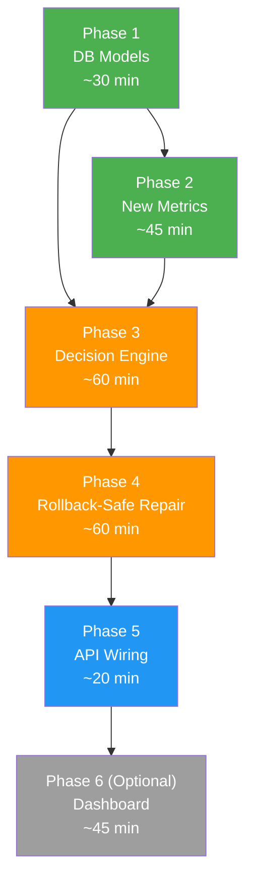

# Integration Plan: Stages 2–4 (MEASURE → DECIDE → ACT)

Goal: Upgrade the existing Self-Organising RAG pipeline from a fixed-order repair waterfall to a **metric-driven, rollback-safe, closed-loop self-healing system**.

## User Review Required

> [!IMPORTANT]
> **Database reset required.** Phase 1 adds new tables and columns. Your existing `autorag.db` will be recreated via `init_db()`. Existing query logs, events, and repair reports will be lost. Back up the DB file if needed.

> [!WARNING]
> **Hallucination Rate metric uses extra LLM calls.** Phase 2 adds an LLM-based claim extractor. Each query evaluation will make 1-2 additional Ollama calls (for claim extraction + claim verification). This will increase evaluation latency. We can make this metric optional via a config flag.

## Open Questions

1. **Hallucination metric — LLM or embedding-based?** The full version uses the LLM to extract and verify individual claims (more accurate, slower). A lighter version uses embedding similarity between answer and context (faster, less precise). Your existing `evidence_mismatch` detector is the lighter version. Which do you prefer?
   - Option A: Full LLM-based claim extraction (accurate, ~2s extra per query)
   - Option B: Enhanced embedding-based (fast, less precise)
   - Option C: Both — LLM for batch evaluation, embedding for real-time detection

2. **Cooldown duration?** How long should the system wait after a repair before attempting another change on the same document source? Suggested: 120 seconds for testing, 3600 seconds (1 hour) for production.

3. **Dashboard updates?** Should I also update your Streamlit [dashboard/app.py](file:///d:/Anantha/Academic/SEM%206/Xtra/HPE_CPP/dashboard/app.py) to display the new metrics and adaptation history? (This would be Phase 6.)

---

## Proposed Changes

### Phase 1 — New Database Models (Foundation)

Everything else depends on these new tables. Must be done first.

---

#### [MODIFY] [models.py](file:///d:/Anantha/Academic/SEM%206/Xtra/HPE_CPP/db/models.py)

Add 3 new tables and extend 2 existing ones:

**New tables:**

1. **`PipelineConfig`** — Tracks the current chunk size, overlap, and strategy. Acts as the system's "configuration state" so we know what to roll back to.
   ```python
   class PipelineConfig(Base):
       __tablename__ = "autorag_pipeline_config"
       id              = Column(Integer, primary_key=True)
       namespace       = Column(String(100))
       chunk_size      = Column(Integer, default=250)
       chunk_overlap   = Column(Integer, default=80)
       chunk_strategy  = Column(String(50), default="semantic")
       active          = Column(Boolean, default=True)     # only one active per namespace
       created_at      = Column(DateTime, default=datetime.utcnow)
   ```

2. **`ChunkSnapshot`** — Stores a copy of old chunks before repair, enabling rollback.
   ```python
   class ChunkSnapshot(Base):
       __tablename__ = "autorag_chunk_snapshots"
       id          = Column(Integer, primary_key=True)
       event_id    = Column(Integer)             # links to the repair event
       vector_id   = Column(String(200))          # Pinecone vector ID
       text        = Column(Text)                 # original chunk text
       metadata    = Column(Text)                 # JSON of original metadata
       namespace   = Column(String(100))
       created_at  = Column(DateTime, default=datetime.utcnow)
   ```

3. **`AdaptationLog`** — Full provenance record: what was observed → decided → changed → resulted.
   ```python
   class AdaptationLog(Base):
       __tablename__ = "autorag_adaptation_log"
       id                = Column(Integer, primary_key=True)
       event_id          = Column(Integer)
       observation       = Column(Text)     # JSON: which metrics failed, values
       diagnosis         = Column(Text)     # JSON: root cause, question category
       strategy_selected = Column(String(50))
       config_before     = Column(Text)     # JSON: old PipelineConfig
       config_after      = Column(Text)     # JSON: new PipelineConfig
       metrics_before    = Column(Text)     # JSON: pre-change metric values
       metrics_after     = Column(Text)     # JSON: post-change metric values
       outcome           = Column(String(20))  # IMPROVED | DEGRADED | NO_CHANGE
       rolled_back       = Column(Boolean, default=False)
       cooldown_until    = Column(DateTime, nullable=True)
       created_at        = Column(DateTime, default=datetime.utcnow)
   ```

**Extended existing tables:**

4. **`QueryLog`** — Add new metric columns:
   ```python
   retrieval_precision  = Column(Float, nullable=True)   # precision@K
   context_sufficiency  = Column(Boolean, nullable=True)  # sufficient or not
   hallucination_rate   = Column(Float, nullable=True)    # 0.0 - 1.0
   question_category    = Column(String(30), nullable=True) # short_factual | complex | cross_section
   ```

5. **`LowRecallEvent`** — Add cooldown tracking:
   ```python
   last_repair_at   = Column(DateTime, nullable=True)
   cooldown_until   = Column(DateTime, nullable=True)
   source_document  = Column(String(200), nullable=True)
   ```

---

### Phase 2 — New Metrics (MEASURE Stage)

Add the 3 missing metrics to your evaluation pipeline.

---

#### [NEW] [metrics.py](file:///d:/Anantha/Academic/SEM%206/Xtra/HPE_CPP/controllers/metrics.py)

New standalone metrics module with 3 functions:

1. **`retrieval_precision_at_k(chunks, ground_truths, threshold=0.5)`**
   - For each chunk, compute semantic similarity to each ground-truth answer
   - A chunk is "relevant" if its best similarity ≥ threshold
   - Return: relevant_count / total_chunks

2. **`context_sufficiency(chunks, ground_truths, threshold=0.7)`**
   - Concatenate all chunks → embed → compare to ground-truth embedding
   - If similarity ≥ threshold → True (sufficient), else False
   - Also check: can ANY single ground truth be semantically matched by the context?

3. **`hallucination_rate(answer, chunks, llm=None)`**
   - Split the answer into individual claims (sentences)
   - For each claim, check if it's supported by any chunk (embedding similarity ≥ 0.6)
   - Return: unsupported_claims / total_claims

4. **`classify_question(query)`**
   - Short factual: ≤ 10 words, likely starts with who/what/when/where
   - Complex: > 15 words, contains "how", "why", "explain", "compare"
   - Cross-section: contains "and", "vs", "relationship between", multiple entities

#### [MODIFY] [evaluation.py](file:///d:/Anantha/Academic/SEM%206/Xtra/HPE_CPP/controllers/evaluation.py)

- Import and call the new metric functions from `metrics.py`
- Add `retrieval_precision`, `context_sufficiency`, `hallucination_rate` to evaluation results
- Add `question_category` classification
- Update the `EvalSnapshot` averages to include the new metrics

#### [MODIFY] [query_logger.py](file:///d:/Anantha/Academic/SEM%206/Xtra/HPE_CPP/logger/query_logger.py)

- Add `update_log_new_metrics()` function to persist the 3 new metric columns per query

---

### Phase 3 — Metric-Driven Strategy Selection (DECIDE Stage)

Replace the fixed waterfall with intelligent diagnosis.

---

#### [NEW] [decision_engine.py](file:///d:/Anantha/Academic/SEM%206/Xtra/HPE_CPP/detector/decision_engine.py)

The core diagnostic engine. Contains:

1. **`diagnose(event, query_log)`** — Analyzes which metrics failed and returns a diagnosis:
   ```python
   def diagnose(event, query_log) -> dict:
       """
       Returns: {
           "root_cause": "chunk_too_large" | "chunk_too_small" | "noise" | "stale" | ...,
           "question_category": "short_factual" | "complex" | "cross_section",
           "severity_score": float,  # 0-1
           "recommended_strategy": "reduce_chunk_size" | "increase_chunk_size" | ...,
           "recommended_config": {"chunk_size": 256, "overlap": 50},
       }
       """
   ```

2. **`select_strategy(diagnosis, current_config, recent_adaptations)`** — Picks the best strategy while respecting:
   - Priority ranking (most severe issue first)
   - Conflict resolution (if "reduce" and "increase" both appear, pick based on worst-performing category)
   - Cooldown (don't reverse a recent change until enough data accumulates)

   Decision rules:
   | Root Cause | Strategy | Config Change |
   |-----------|----------|---------------|
   | `chunk_too_large` (low precision, short Qs) | `reduce_chunk_size` | chunk_size: 512→256, overlap: 80→50 |
   | `chunk_too_small` (low sufficiency, complex Qs) | `increase_chunk_size` | chunk_size: 250→512, overlap: 80→120 |
   | `cross_section_failure` | `large_coherent_chunks` | chunk_size: 1024+, overlap: 200 |
   | `high_hallucination` | `tighten_chunks` | chunk_size→200, overlap→40 |
   | `stale_content` | `re_ingest` | trigger auto_indexer |

3. **`check_cooldown(event, session)`** — Returns True if the event's source is still in cooldown period.

#### [MODIFY] [main.py](file:///d:/Anantha/Academic/SEM%206/Xtra/HPE_CPP/main.py)

Replace the `STRATEGY_WATERFALL` logic in `autonomous_maintenance_loop()` with:
```python
from detector.decision_engine import diagnose, select_strategy, check_cooldown

# Instead of: current_strategy = STRATEGY_WATERFALL[event.attempts]
# Do:
if check_cooldown(event, session):
    continue  # skip, still in cooldown

diagnosis = diagnose(event, log)
strategy, new_config = select_strategy(diagnosis, current_config, recent_adaptations)
result = handle_event(event.id, strategy=strategy, config=new_config)
```

---

### Phase 4 — Dynamic Chunk Size & Rollback-Safe Repair (ACT Stage)

Make the repair pipeline accept dynamic parameters and support safe rollback.

---

#### [MODIFY] [chunker.py](file:///d:/Anantha/Academic/SEM%206/Xtra/HPE_CPP/repair/chunker.py)

Make `rechunk_semantic` accept configurable chunk size and overlap:
```python
def rechunk_semantic(text, source, chunk_size=250, overlap=80):
    splitter = RecursiveCharacterTextSplitter(
        chunk_size=chunk_size, chunk_overlap=overlap, ...
    )
```

Add a new strategy function:
```python
def rechunk_fixed(text, source, chunk_size=256, overlap=50):
    """Strategy for precise small chunks — used for tighten_chunks."""
```

#### [MODIFY] [reembedder.py](file:///d:/Anantha/Academic/SEM%206/Xtra/HPE_CPP/repair/reembedder.py)

Add snapshot-before-delete functionality:
```python
def reembed(new_chunks, source, old_chunk_ids=None, namespace=None, event_id=None):
    # NEW: Before deleting, save a snapshot
    if old_chunk_ids and event_id:
        _save_chunk_snapshot(old_chunk_ids, namespace, event_id)
    
    # ... existing delete + insert logic ...
```

Add rollback function:
```python
def rollback_from_snapshot(event_id, namespace=None):
    """Restores old chunks from ChunkSnapshot and deletes the new ones."""
```

#### [MODIFY] [orchestrator.py](file:///d:/Anantha/Academic/SEM%206/Xtra/HPE_CPP/repair/orchestrator.py)

Major changes to `handle_event()`:

1. Accept `config` parameter (chunk_size, overlap from decision engine)
2. Pass `event_id` to `reembed()` for snapshotting
3. After probe: if NOT improved → call `rollback_from_snapshot(event_id)`
4. Run a **broader validation** — not just the single failing query, but a mini benchmark of 5 recent queries from the same source
5. Write an `AdaptationLog` entry with full provenance
6. Set cooldown on the event/source

```python
def handle_event(event_id, strategy="semantic", config=None):
    # ... existing setup ...
    
    # NEW: Save config snapshot
    config_before = get_active_config(namespace)
    
    # NEW: Rechunk with dynamic config
    chunk_size = config.get("chunk_size", 250) if config else 250
    overlap = config.get("overlap", 80) if config else 80
    new_chunks = rechunk_fn(full_text, source, chunk_size=chunk_size, overlap=overlap)
    
    # NEW: Reembed with snapshot
    counts = reembed(new_chunks, source, old_chunk_ids=chunk_ids, event_id=event_id)
    
    # NEW: Broader validation (not just single query)
    score_after = _probe_score(log.query)
    broader_ok = _validate_nearby_queries(source, namespace)
    
    improved = score_after > score_before + 0.05 and broader_ok
    
    # NEW: Rollback if degraded
    if not improved:
        rollback_from_snapshot(event_id)
        score_after = score_before  # reverted
    
    # NEW: Log full provenance
    _log_adaptation(event_id, diagnosis, config_before, config_after, 
                    metrics_before, metrics_after, improved)
    
    # NEW: Set cooldown
    event.cooldown_until = datetime.utcnow() + timedelta(seconds=COOLDOWN_SECONDS)
```

---

### Phase 5 — Wiring & API Endpoints

Connect everything together.

---

#### [MODIFY] [routes.py](file:///d:/Anantha/Academic/SEM%206/Xtra/HPE_CPP/api/routes.py)

Add new endpoints:

1. **`GET /api/v1/pipeline-config`** — Returns the current active PipelineConfig
2. **`GET /api/v1/adaptation-log`** — Returns recent AdaptationLog entries (provenance trail)
3. **`POST /api/v1/pipeline-config`** — Manually override chunk size / strategy (for testing)

#### [MODIFY] [config.py](file:///d:/Anantha/Academic/SEM%206/Xtra/HPE_CPP/config.py)

Add new settings:
```python
# Stage 2-4 Thresholds
precision_threshold: float = 0.5
sufficiency_threshold: float = 0.7
hallucination_threshold: float = 0.2
cooldown_seconds: int = 120       # 2 min for testing
enable_hallucination_llm: bool = False  # use LLM-based claim extraction
```

---

### Phase 6 (Optional) — Dashboard Updates

#### [MODIFY] [app.py](file:///d:/Anantha/Academic/SEM%206/Xtra/HPE_CPP/dashboard/app.py)

Add new dashboard sections:
- **Metric Gauges**: Retrieval Precision, Context Sufficiency, Hallucination Rate
- **Adaptation Timeline**: Visual history of all strategy decisions and their outcomes
- **Pipeline Config Panel**: Current chunk size, overlap, strategy with manual override
- **Rollback History**: Table of all rollbacks with before/after metrics

---

## Verification Plan

### Automated Tests

After each phase, run the API server and test:

```bash
# Start the server
uvicorn main:app --reload

# Phase 1: Verify DB tables created
# Check SQLite for new tables
python -c "from db.session import init_db; init_db(); print('OK')"

# Phase 2: Test new metrics
curl -X POST http://localhost:8000/api/v1/evaluate-local \
  -F "file=@Qun_Ans1.json" -F "namespace=mxbai-embed-large" -F "max_questions=5"
# Verify response includes retrieval_precision, context_sufficiency, hallucination_rate

# Phase 3-4: Test metric-driven repair
curl -X POST http://localhost:8000/api/v1/query \
  -H "Content-Type: application/json" -d '{"query": "test query"}'
# Then check /events for new events
# Then check /adaptation-log for decision provenance

# Phase 4: Test rollback
curl http://localhost:8000/api/v1/adaptation-log
# Verify rolled_back field appears when repair degrades metrics
```

### Manual Verification

1. Run a batch evaluation with 10-20 questions from `Qun_Ans1.json`
2. Verify that LowRecallEvents now trigger metric-based strategy selection (not fixed waterfall)
3. Intentionally trigger a bad repair by setting very small chunk_size → verify system rolls back
4. Check the AdaptationLog table for complete provenance entries
5. Verify cooldown prevents immediate re-repair of the same source

---

## Implementation Order & Dependencies



> [!TIP]
> **Phases 1-2** can be built and tested independently — they add new metrics without breaking existing behavior. **Phases 3-4** are the core intelligence upgrade. **Phase 5** wires it all together. **Phase 6** is optional polish.

## Files Changed Summary

| Phase | File | Action | Risk |
|-------|------|--------|------|
| 1 | [models.py](file:///d:/Anantha/Academic/SEM%206/Xtra/HPE_CPP/db/models.py) | MODIFY — add 3 tables, extend 2 | 🟡 DB reset |
| 2 | [metrics.py](file:///d:/Anantha/Academic/SEM%206/Xtra/HPE_CPP/controllers/metrics.py) | NEW | 🟢 No risk |
| 2 | [evaluation.py](file:///d:/Anantha/Academic/SEM%206/Xtra/HPE_CPP/controllers/evaluation.py) | MODIFY — add new metrics | 🟢 Low |
| 2 | [query_logger.py](file:///d:/Anantha/Academic/SEM%206/Xtra/HPE_CPP/logger/query_logger.py) | MODIFY — add update fn | 🟢 Low |
| 3 | [decision_engine.py](file:///d:/Anantha/Academic/SEM%206/Xtra/HPE_CPP/detector/decision_engine.py) | NEW | 🟢 No risk |
| 3 | [main.py](file:///d:/Anantha/Academic/SEM%206/Xtra/HPE_CPP/main.py) | MODIFY — replace waterfall | 🟡 Core logic |
| 4 | [chunker.py](file:///d:/Anantha/Academic/SEM%206/Xtra/HPE_CPP/repair/chunker.py) | MODIFY — add params | 🟢 Low |
| 4 | [reembedder.py](file:///d:/Anantha/Academic/SEM%206/Xtra/HPE_CPP/repair/reembedder.py) | MODIFY — add snapshot + rollback | 🟡 Medium |
| 4 | [orchestrator.py](file:///d:/Anantha/Academic/SEM%206/Xtra/HPE_CPP/repair/orchestrator.py) | MODIFY — major rewrite | 🔴 Core logic |
| 5 | [routes.py](file:///d:/Anantha/Academic/SEM%206/Xtra/HPE_CPP/api/routes.py) | MODIFY — add 3 endpoints | 🟢 Low |
| 5 | [config.py](file:///d:/Anantha/Academic/SEM%206/Xtra/HPE_CPP/config.py) | MODIFY — add thresholds | 🟢 Low |
| 6 | [app.py](file:///d:/Anantha/Academic/SEM%206/Xtra/HPE_CPP/dashboard/app.py) | MODIFY — new panels | 🟢 Optional |
