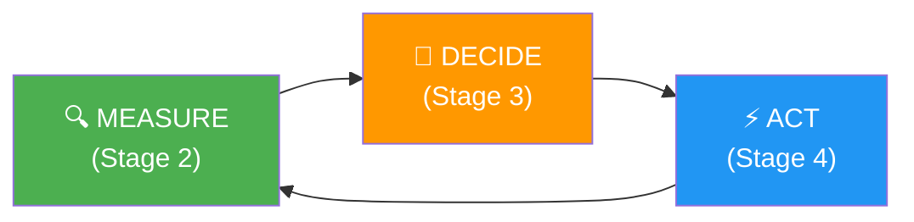
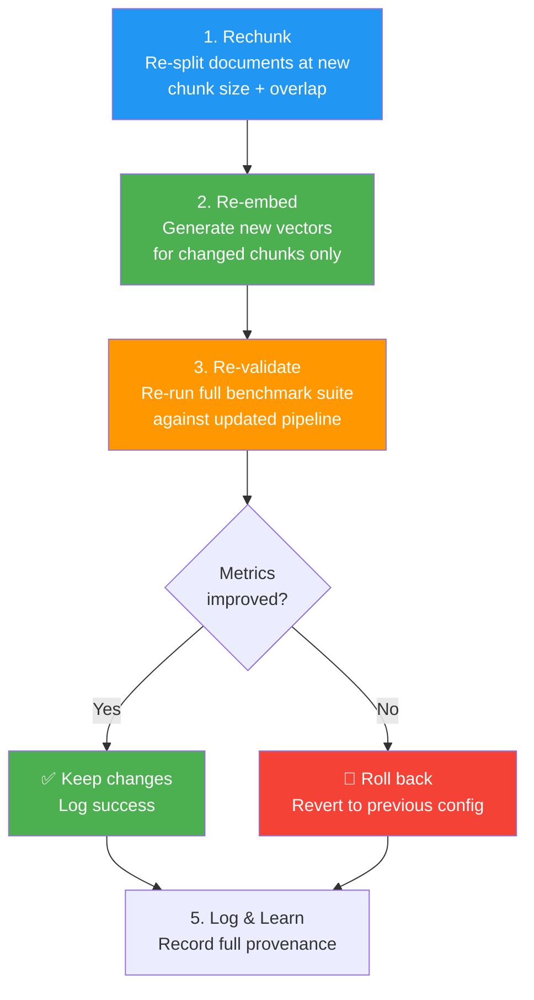
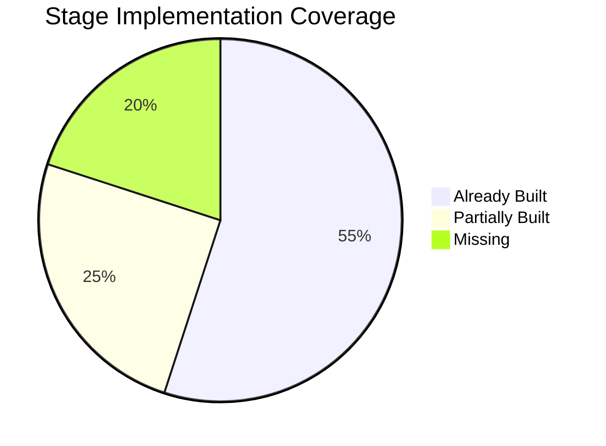

# Stages 2–4 Explained — and How They Map to Your Project

## What Are These Stages?

These three stages describe a **closed-loop self-healing cycle** for a RAG pipeline. Think of it like a thermostat for your retrieval system:



The system continuously **monitors** its own performance, **diagnoses** what's going wrong, and **fixes** itself — all without human intervention.

---

## Stage 2 — MEASURE (The Feedback Loop)

### What It's Saying

After every query (or batch of queries), the system computes **5 metrics** against ground-truth benchmarks to quantify how well it's performing:

| # | Metric | What It Measures | Example |
|---|--------|-----------------|---------|
| 1 | **Retrieval Precision** | Are the top-K retrieved chunks actually relevant? | If 3 out of 5 chunks are relevant → 60% precision |
| 2 | **Answer Correctness** | Does the generated answer cover the key facts from the reference answer? | Key-fact coverage score 0–100% |
| 3 | **Context Sufficiency** | Does the retrieved context contain *enough* info to fully answer? | If the correct answer needs info not in any chunk → insufficient |
| 4 | **Latency** | End-to-end response time (embedding + retrieval + generation) | 1200ms |
| 5 | **Hallucination Rate** | % of claims in the answer that can't be traced back to retrieved context | If 2 out of 10 claims are unsupported → 20% hallucination |

### What You Already Have ✅

Your project already implements parts of this in several files:

| Your Code | Maps To | Coverage |
|-----------|---------|----------|
| [evaluation.py](file:///d:/Anantha/Academic/SEM%206/Xtra/HPE_CPP/controllers/evaluation.py) — `rouge_l()` | Answer Correctness | ⚠️ Partial — ROUGE-L measures word overlap, not key-fact coverage |
| [evaluation.py](file:///d:/Anantha/Academic/SEM%206/Xtra/HPE_CPP/controllers/evaluation.py) — `semantic_similarity()` | Answer Correctness | ✅ Good proxy via embedding similarity |
| [evaluation.py](file:///d:/Anantha/Academic/SEM%206/Xtra/HPE_CPP/controllers/evaluation.py) — `context_similarity()` | Retrieval Precision & Context Sufficiency | ⚠️ Partial — measures similarity but not precision@K or sufficiency |
| [query_logger.py](file:///d:/Anantha/Academic/SEM%206/Xtra/HPE_CPP/logger/query_logger.py) — `latency_ms` | Latency | ✅ Already tracked |
| [detectors.py](file:///d:/Anantha/Academic/SEM%206/Xtra/HPE_CPP/detector/detectors.py) — `_detect_evidence_mismatch()` | Hallucination Rate | ⚠️ Partial — binary detection, not a rate % |

### What's Missing ❌

1. **Retrieval Precision@K** — You don't compute "what fraction of top-K chunks are actually relevant". You'd need ground-truth chunk labels or use the ground-truth answer to judge relevance.
2. **Context Sufficiency** — You compute `ctx_ground_truth_sim` (how similar context is to ground truth), but you don't have a binary "sufficient / insufficient" judgment.
3. **Hallucination Rate as a %** — Your `evidence_mismatch` detector is a boolean flag. The description wants a percentage (e.g., "3 out of 10 claims are ungrounded = 30%").
4. **Per-query metric tracking** — Your `EvalSnapshot` stores batch averages. The description implies per-query metric storage for pattern analysis.

---

## Stage 3 — DECIDE (Strategy Selection)

### What It's Saying

When metrics drop below thresholds, the system **diagnoses the root cause** and **picks a repair strategy**. This is a rule-based decision engine:

| Observed Pattern | Diagnosis | Strategy |
|-----------------|-----------|----------|
| Low precision on short factual Qs | Chunks are too big, relevant info is diluted | **Reduce chunk size** (512 → 256) |
| Insufficient context on complex Qs | Chunks are too small, missing surrounding context | **Increase chunk size or overlap** |
| Cross-section retrieval failures | Document coherence is lost across paragraphs | **Re-index with large chunks** (1024+) |
| High hallucination rate | Too much noise in chunks confusing the LLM | **Tighten chunk boundaries** (smaller, precise) |
| Stale content drift | Source documents changed but vectors are old | **Re-ingest & re-embed** updated sources |

Key design principles:
- **Priority ranking**: If multiple problems co-occur, fix the most severe one first
- **Conflict resolution**: "Reduce chunk size" and "Increase chunk size" can't both run — the system picks based on which question category is failing worst
- **Cooldown mechanism**: After making a change, the system waits for enough new evaluation data before reversing the change (prevents flip-flopping)

### What You Already Have ✅

| Your Code | Maps To |
|-----------|---------|
| [orchestrator.py](file:///d:/Anantha/Academic/SEM%206/Xtra/HPE_CPP/repair/orchestrator.py) — `STRATEGY_MAP` | Strategy selection (semantic / llm / entropy) |
| [main.py](file:///d:/Anantha/Academic/SEM%206/Xtra/HPE_CPP/main.py) — `STRATEGY_WATERFALL` | Priority ordering of strategies |
| [main.py](file:///d:/Anantha/Academic/SEM%206/Xtra/HPE_CPP/main.py) — `event.attempts >= len(STRATEGY_WATERFALL)` | Circuit breaker (marks events "unfixable" after exhausting all strategies) |
| [detectors.py](file:///d:/Anantha/Academic/SEM%206/Xtra/HPE_CPP/detector/detectors.py) — severity scoring | Severity-based prioritization (LOW/MEDIUM/HIGH) |

### What's Missing ❌

1. **Metric-driven strategy selection** — Your current system uses a fixed waterfall (`semantic → entropy → llm`). The description says the system should *diagnose* the root cause from metrics and pick the *right* strategy. For example:
   - If `retrieval_precision` is low on short queries → pick "reduce chunk size"
   - If `context_sufficiency` is low on complex queries → pick "increase chunk size"
   - Your system doesn't correlate metrics to strategies — it just tries them in order.

2. **Chunk size as a tunable parameter** — Your [chunker.py](file:///d:/Anantha/Academic/SEM%206/Xtra/HPE_CPP/repair/chunker.py) has fixed chunk sizes (250 chars for semantic). The description says chunk size should be dynamically adjusted (256/512/1024) based on the diagnosis.

3. **Cooldown mechanism** — Your system doesn't prevent oscillation. If a change is made and doesn't help, it immediately tries the next strategy. The description says: wait until enough data accumulates to confirm the change helped or harmed.

4. **Question category classification** — The description groups questions by type (short factual, complex, cross-section). Your system treats all queries equally.

5. **Conflict resolution logic** — No mechanism to handle contradictory strategies.

---

## Stage 4 — ACT (Autonomous Pipeline Modification)

### What It's Saying

Once a strategy is chosen, execute it through a **controlled, reversible pipeline**:



### What You Already Have ✅

| Your Code | Maps To |
|-----------|---------|
| [chunker.py](file:///d:/Anantha/Academic/SEM%206/Xtra/HPE_CPP/repair/chunker.py) — `rechunk_semantic/llm/entropy` | **Rechunk** step |
| [reembedder.py](file:///d:/Anantha/Academic/SEM%206/Xtra/HPE_CPP/repair/reembedder.py) — `reembed()` | **Re-embed** step (safe partial replacement) |
| [orchestrator.py](file:///d:/Anantha/Academic/SEM%206/Xtra/HPE_CPP/repair/orchestrator.py) — `_probe_score()` | **Re-validate** step (checks if score improved) |
| [orchestrator.py](file:///d:/Anantha/Academic/SEM%206/Xtra/HPE_CPP/repair/orchestrator.py) — `RepairReport` | **Log & Learn** step |
| [engine.py](file:///d:/Anantha/Academic/SEM%206/Xtra/HPE_CPP/auto_indexer/engine.py) — `detect_stale_chunks()` | **Stale content drift** detection |
| [engine.py](file:///d:/Anantha/Academic/SEM%206/Xtra/HPE_CPP/auto_indexer/engine.py) — `reembed_stale()` | **Re-embed for stale content** |

### What's Missing ❌

1. **Rollback mechanism** — Your `orchestrator.py` checks if score improved, but if it didn't improve, it just marks the event as unresolved. The old chunks are **already deleted** — there's no way to restore them. The description says the system should **revert to the previous configuration**.

2. **Full benchmark re-validation** — Your probe only checks the *single failing query's* top-1 score. The description says re-run the **full benchmark suite** to ensure the change didn't break other queries.

3. **Configuration versioning** — No record of "what chunk size was used before vs. after". The `RepairReport` logs chunk counts but not the configuration parameters.

4. **Provenance chain** — The description wants: "what was observed → what was decided → what was changed → what resulted". Your `RepairReport` partially covers this but doesn't record the diagnostic reasoning.

---

## Summary: Your Coverage Map



| Capability | Status | Where It Lives |
|-----------|--------|---------------|
| Query logging + latency | ✅ Done | [query_logger.py](file:///d:/Anantha/Academic/SEM%206/Xtra/HPE_CPP/logger/query_logger.py) |
| 6-rule anomaly detection | ✅ Done | [detectors.py](file:///d:/Anantha/Academic/SEM%206/Xtra/HPE_CPP/detector/detectors.py) |
| ROUGE-L + Semantic Sim evaluation | ✅ Done | [evaluation.py](file:///d:/Anantha/Academic/SEM%206/Xtra/HPE_CPP/controllers/evaluation.py) |
| 3-strategy rechunking | ✅ Done | [chunker.py](file:///d:/Anantha/Academic/SEM%206/Xtra/HPE_CPP/repair/chunker.py) |
| Safe partial re-embedding | ✅ Done | [reembedder.py](file:///d:/Anantha/Academic/SEM%206/Xtra/HPE_CPP/repair/reembedder.py) |
| Auto-healing background loop | ✅ Done | [main.py](file:///d:/Anantha/Academic/SEM%206/Xtra/HPE_CPP/main.py) |
| Stale content detection + refresh | ✅ Done | [engine.py](file:///d:/Anantha/Academic/SEM%206/Xtra/HPE_CPP/auto_indexer/engine.py) |
| Retrieval Precision@K metric | ❌ Missing | — |
| Context Sufficiency metric | ❌ Missing | — |
| Hallucination Rate (%) metric | ❌ Missing | — |
| Metric-driven strategy selection | ❌ Missing | — |
| Dynamic chunk size tuning | ⚠️ Partial | Fixed sizes in [chunker.py](file:///d:/Anantha/Academic/SEM%206/Xtra/HPE_CPP/repair/chunker.py) |
| Cooldown / anti-oscillation | ❌ Missing | — |
| Rollback on degradation | ❌ Missing | — |
| Full benchmark re-validation | ⚠️ Partial | Single-query probe only |
| Configuration versioning | ❌ Missing | — |
| Question category classification | ❌ Missing | — |

---

## How to Use This in Your Project — Practical Next Steps

> [!TIP]
> You don't need to build everything at once. The items below are ordered by impact — start from the top.

### 1. Add the Missing Metrics (Stage 2)

Add three new metric functions to [evaluation.py](file:///d:/Anantha/Academic/SEM%206/Xtra/HPE_CPP/controllers/evaluation.py):

- **Retrieval Precision@K**: For each query, check how many of the top-K chunks contain information relevant to the ground-truth answer (using semantic similarity threshold).
- **Context Sufficiency**: Binary check — can the ground-truth answer be reconstructed from the retrieved chunks? (Compare ground-truth embedding against concatenated chunk embeddings with a higher threshold).
- **Hallucination Rate**: Use the LLM to extract claims from the generated answer, then check each claim against the retrieved context.

### 2. Add Metric-Driven Strategy Selection (Stage 3)

Replace the fixed waterfall in [main.py](file:///d:/Anantha/Academic/SEM%206/Xtra/HPE_CPP/main.py) with a diagnostic function that looks at *which metrics failed* and picks the right strategy:

```python
def diagnose_and_select_strategy(event, query_log):
    """Pick strategy based on WHAT failed, not just attempt count."""
    triggers = json.loads(event.triggered_detectors)
    
    if "low_top_score" in triggers and len(query_log.query.split()) < 10:
        return "reduce_chunk_size"     # Short query, chunks too big
    elif "semantic_mismatch" in triggers:
        return "increase_chunk_size"   # Complex query, need more context
    elif "evidence_mismatch" in triggers:
        return "tighten_chunks"        # Hallucination, reduce noise
    else:
        return "semantic"              # Default fallback
```

### 3. Make Chunk Size a Tunable Parameter (Stage 3 + 4)

Change [chunker.py](file:///d:/Anantha/Academic/SEM%206/Xtra/HPE_CPP/repair/chunker.py) to accept `chunk_size` and `overlap` as parameters instead of hardcoding them:

```python
def rechunk_semantic(text, source, chunk_size=250, overlap=80):
    splitter = RecursiveCharacterTextSplitter(
        chunk_size=chunk_size, chunk_overlap=overlap, ...
    )
```

### 4. Add Rollback Capability (Stage 4)

Before deleting old chunks in [reembedder.py](file:///d:/Anantha/Academic/SEM%206/Xtra/HPE_CPP/repair/reembedder.py), **save a snapshot** of the old vectors (IDs + text + metadata) to a new DB table. If the repair fails, restore from the snapshot.

### 5. Add Cooldown Timer (Stage 3)

Add a `last_repair_timestamp` to `LowRecallEvent`. After a repair, set a cooldown period (e.g., 60 seconds during testing). Don't re-attempt repair on the same document source until cooldown expires.

> [!IMPORTANT]
> The key insight is: **your project already has about 55% of this built**. The biggest gaps are in the *intelligence* of the DECIDE stage (metric-driven diagnosis instead of fixed waterfall) and the *safety* of the ACT stage (rollback on degradation).
