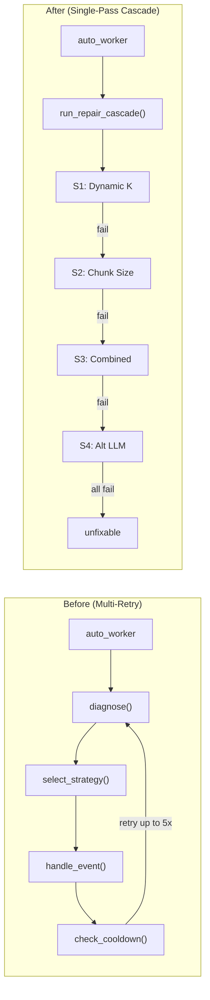

# Walkthrough: Ordered Repair Cascade Implementation

## Summary

Replaced the multi-retry repair loop with a **single-pass 4-strategy cascade** + promotion system, as specified in [claude.md](file:///d:/Anantha/Academic/SEM%206/Xtra/HPE_CPP/claude.md).

---

## Architecture Change



## Files Modified/Created

### [NEW] [cascade.py](file:///d:/Anantha/Academic/SEM%206/Xtra/HPE_CPP/repair/cascade.py)
- `run_repair_cascade(event_id)` — single-pass ordered cascade
- `_run_s1_dynamic_k()` — varies K by question category
- `_run_s2_chunk_size()` — rechunks using diagnose() config
- `_run_s3_combined()` — dynamic K + rechunk together
- `_run_s4_alt_llm()` — swaps to gemma3:27b on same chunks
- `increment_counter()` / `maybe_promote_dynamic_k()` — counter + promotion

### [MODIFY] [models.py](file:///d:/Anantha/Academic/SEM%206/Xtra/HPE_CPP/db/models.py)
Added two tables:
| Table | Purpose |
|---|---|
| `StrategyCounter` | Tracks success count per strategy |
| `RuntimeFlag` | Boolean flags for one-way promotions |

### [MODIFY] [orchestrator.py](file:///d:/Anantha/Academic/SEM%206/Xtra/HPE_CPP/repair/orchestrator.py)
- **Removed**: Auto-resolve, query reformulation fallback, LLM fallback
- **Removed**: RepairReport + AdaptationLog writes (now in cascade.py)
- **Kept**: `handle_event()` as rechunk + probe + rollback primitive for S2/S3

### [MODIFY] [auto_worker.py](file:///d:/Anantha/Academic/SEM%206/Xtra/HPE_CPP/auto_worker.py)
- **New trigger**: `pending ≥ 5 AND pending/total ≥ 30%`
- **Processes ALL** pending events (not first 5)
- Calls `run_repair_cascade()` instead of old diagnose/select/handle chain
- No more retries, cooldowns, or MAX_ATTEMPTS

### [MODIFY] [retrieval.py](file:///d:/Anantha/Academic/SEM%206/Xtra/HPE_CPP/controllers/retrieval.py)
- Added `_resolve_main_k(query)` — reads RuntimeFlag, returns dynamic K if promoted
- Both `answer_query()` and `generate_answer_only()` use dynamic K

### [MODIFY] [decision_engine.py](file:///d:/Anantha/Academic/SEM%206/Xtra/HPE_CPP/detector/decision_engine.py)
- `select_strategy()`, `check_cooldown()`, `set_cooldown()` marked **DEPRECATED**
- `diagnose()` and `STRATEGY_CONFIGS` kept active (used by S2/S3)

### [MODIFY] [routes.py](file:///d:/Anantha/Academic/SEM%206/Xtra/HPE_CPP/api/routes.py)
- `POST /repair/{event_id}` now calls `run_repair_cascade()` instead of `handle_event()`
- **New**: `GET /strategy-counters` — returns all strategy success counts
- **New**: `GET /runtime-flags` — returns all promotion flags

---

## Cascade Flow

```
Event flagged → run_repair_cascade(event_id)
  │
  ├─ S1: Dynamic K (no Pinecone change)
  │   └─ _is_improved()? → YES → resolved ✅, increment s1_dynamic_k counter
  │                        → NO  → continue
  │
  ├─ S2: Chunk Size via diagnose() (Pinecone write + rollback)
  │   └─ _is_improved()? → YES → resolved ✅, increment s2_chunk_size counter
  │                        → NO  → rollback, continue
  │
  ├─ S3: Combined K + Rechunk (Pinecone write + rollback)
  │   └─ _is_improved()? → YES → resolved ✅, increment s3_combined counter
  │                        → NO  → rollback, continue
  │
  └─ S4: Alt LLM gemma3:27b (no Pinecone change)
      └─ _is_improved()? → YES → resolved ✅, increment s4_alt_llm counter
                           → NO  → unfixable ❌
```

## Promotion Logic

When `s1_dynamic_k.success_count >= 5`:
1. `RuntimeFlag("dynamic_k_promoted")` set to True
2. `controllers/retrieval.py` reads the flag on every request
3. Main pipeline uses dynamic K instead of hardcoded K=5
4. Cascade **skips S1** for future events (already in main pipeline)
