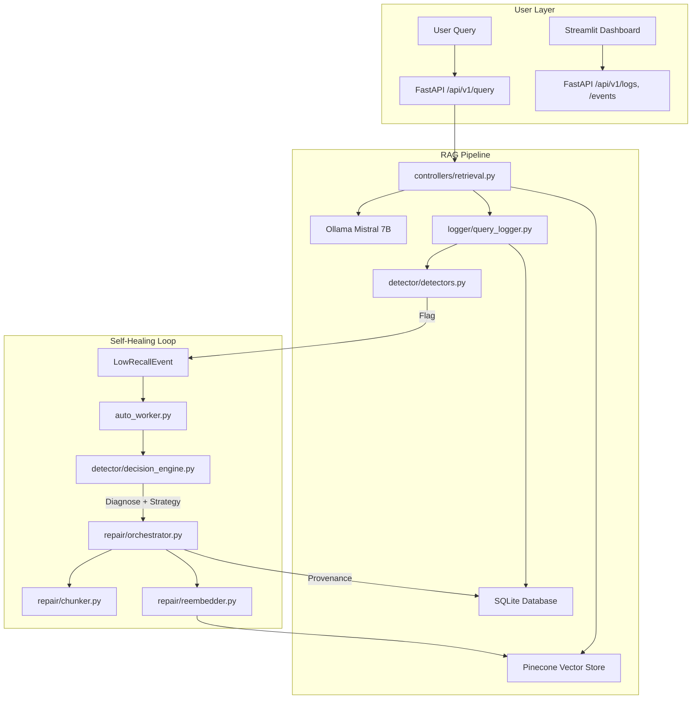
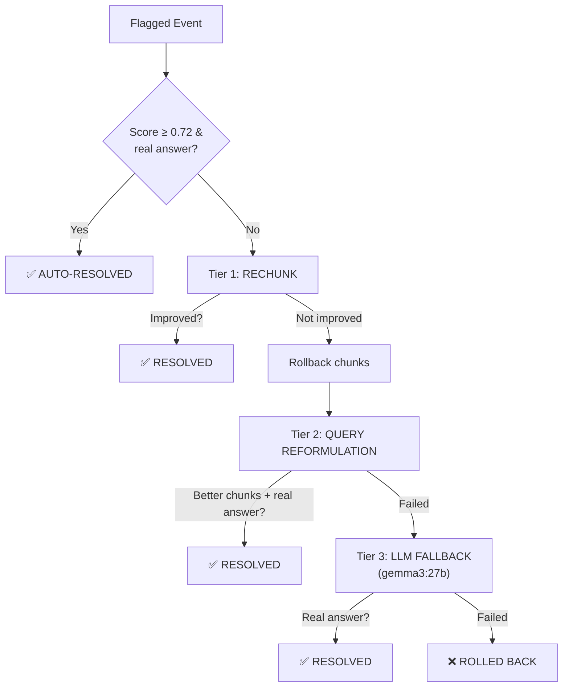
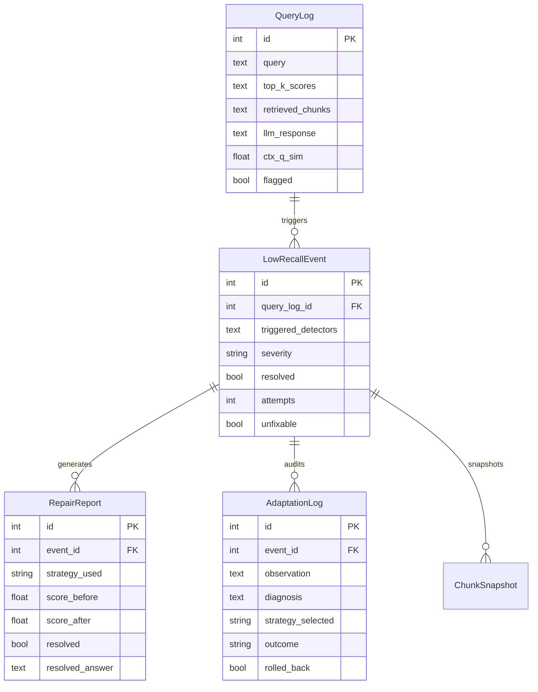

# Self-Organising RAG — Complete System Explanation

## Overview

This is a **self-healing Retrieval-Augmented Generation (RAG)** system that automatically detects, diagnoses, and repairs poor retrieval quality — without human intervention.

The system ingests documents into a Pinecone vector store, answers user questions using LLM + retrieved chunks, and **automatically monitors and repairs itself** when answer quality degrades.

---

## Architecture Diagram



---

## System Components

### 1. Core RAG Pipeline

| File | Purpose |
|------|---------|
| [main.py](file:///e:/CPP/anantha/main.py) | FastAPI app entry point, initializes DB |
| [api/routes.py](file:///e:/CPP/anantha/api/routes.py) | REST endpoints for query, ingest, repair, evaluation |
| [controllers/retrieval.py](file:///e:/CPP/anantha/controllers/retrieval.py) | RAG answer generation: retrieve chunks → LLM answer |
| [controllers/ingestion.py](file:///e:/CPP/anantha/controllers/ingestion.py) | Document upload, text cleaning, chunking, Pinecone ingestion |
| [services/llm_factory.py](file:///e:/CPP/anantha/services/llm_factory.py) | Cached singletons: Ollama LLM, embeddings, Pinecone index |
| [config.py](file:///e:/CPP/anantha/config.py) | Pydantic settings loaded from `.env` |

**How a query works:**
```
User → POST /api/v1/query → retrieval.answer_query()
  → Pinecone similarity_search (k=5)
  → LLM generates answer from top-5 chunks
  → log_query() writes to SQLite
  → run_detectors() checks for quality issues
  → Returns answer + scores to user
```

---

### 2. Stage 1: DETECT — Quality Monitoring

**File:** [detector/detectors.py](file:///e:/CPP/anantha/detector/detectors.py)

Six independent detection rules run after every query. If any trigger, a `LowRecallEvent` is created:

| # | Rule | What it Detects | Threshold |
|---|------|----------------|-----------|
| 1 | `low_top_score` | Top-1 retrieval score too low | < 0.65 |
| 2 | `score_drop` | Big gap between rank-1 and rank-K | > 0.15 gap |
| 3 | `llm_uncertainty` | LLM response contains hedging language | 50+ phrases |
| 4 | `semantic_mismatch` | Retrieved chunks are about different topics | pairwise sim < 0.70 |
| 5 | `evidence_mismatch` | LLM answer doesn't match the evidence | answer↔evidence sim < 0.60 |
| 6 | `user_frustration` | Same question re-asked within 5 minutes | cosine sim > 0.85 |

> [!NOTE]
> Thresholds are calibrated for `mxbai-embed-large` which produces scores in the 0.55–0.85 range (higher than typical models).

**Severity levels:**
- 1 detector → `LOW`
- 2 detectors → `MEDIUM`
- 3+ detectors → `HIGH`

---

### 3. Stage 2: MEASURE — Metrics Collection

**File:** [controllers/metrics.py](file:///e:/CPP/anantha/controllers/metrics.py)

When evaluation runs, these metrics are computed per-query:

| Metric | Description |
|--------|-------------|
| `retrieval_precision` | Fraction of top-K chunks relevant to the answer |
| `context_sufficiency` | Whether context covers the full answer |
| `hallucination_rate` | Fraction of ungrounded claims in the answer |
| `question_category` | `short_factual` / `complex` / `cross_section` |

---

### 4. Stage 3: DECIDE — Diagnosis & Strategy Selection

**File:** [detector/decision_engine.py](file:///e:/CPP/anantha/detector/decision_engine.py)

The decision engine analyzes **which detectors fired** + **question category** + **metrics** to determine a root cause and select the best repair strategy:

| Root Cause | When | Strategy | Chunk Config |
|-----------|------|----------|-------------|
| `high_hallucination` | Hallucination rate > 0.3 | `tighten_chunks` | 200 / 40 |
| `chunk_too_large` | Short factual + low score | `reduce_chunk_size` | 256 / 50 |
| `cross_section_failure` | Cross-section + fragmented | `large_coherent_chunks` | 1024 / 200 |
| `chunk_too_small` | Complex + insufficient context | `increase_chunk_size` | 512 / 120 |
| `stale_content` | Score drop + very low score | `re_ingest` | Keep current |
| `general_degradation` | Multiple triggers, no clear cause | `reduce_chunk_size` | 256 / 50 |

**Conflict resolution:** If the recommended strategy contradicts a recent successful adaptation (e.g., "reduce" after "increase" that worked), it keeps the working strategy.

**Fallback rotation:** If a strategy recently failed, the system tries an alternative (e.g., `reduce_chunk_size` failed → try `tighten_chunks`).

---

### 5. Stage 4: ACT — 3-Tier Repair Pipeline

**File:** [repair/orchestrator.py](file:///e:/CPP/anantha/repair/orchestrator.py)

The repair pipeline executes in 3 tiers, each targeting a different failure mode:



#### Tier 0: Auto-Resolve
If the retrieval score is already ≥ 0.72 and the LLM produces a real answer (not a non-answer), the event is auto-resolved. The flag was for `llm_uncertainty` (hedging language), not poor retrieval.

#### Tier 1: Rechunking
1. Find the specific chunk IDs retrieved for the failing query
2. Concatenate their text
3. Re-split with a new chunk size/overlap from the decision engine
4. Snapshot old chunks → delete → insert new chunks
5. Re-probe metrics: if improved → keep; if degraded → rollback

#### Tier 2: Query Reformulation
After rechunking fails and is rolled back:
1. Ask the LLM to rephrase the query with different keywords
2. Use the reformulated query to search the **entire index** for different chunks
3. If better chunks found, generate the answer using the **original question** + the better chunks
4. If the answer is substantive → resolved

#### Tier 3: LLM Fallback (gemma3:27b)
After rechunking and reformulation both fail:
1. Take the same chunks from the original query
2. Send them to `gemma3:27b` (27B params) instead of `mistral` (7B)
3. The larger model may extract answers that the smaller model couldn't
4. If the answer is substantive → resolved

> [!IMPORTANT]
> **No chunks are modified in Tier 2 or Tier 3.** Tier 2 searches for different chunks. Tier 3 uses a different LLM on the same chunks. Only Tier 1 modifies the vector store.

---

### 6. Safety: Rollback & Provenance

#### Rollback ([reembedder.py](file:///e:/CPP/anantha/repair/reembedder.py))
Before any chunk deletion, a `ChunkSnapshot` is saved to SQLite. If repair fails:
1. Delete the new chunks that were inserted
2. Load old chunks from snapshot
3. Re-embed and upsert back to Pinecone
4. Clean up snapshot entries

#### Provenance
Every repair attempt writes two records:
- **RepairReport**: score before/after, chunks before/after, strategy, resolved answer
- **AdaptationLog**: full audit trail — observation → diagnosis → strategy → config → metrics → outcome

---

### 7. Dynamic K Selection

**File:** [orchestrator.py](file:///e:/CPP/anantha/repair/orchestrator.py#L58-L99)

Instead of fixed K=5 for all queries, the system dynamically selects K based on:

| Question Category | K Range | Rationale |
|-------------------|---------|-----------|
| `short_factual` | 2–4 | Precise, focused retrieval |
| `complex` | 5–8 | Need more context |
| `cross_section` | 6–10 | Spanning multiple topics |

**Score cliff detection:** If there's a > 0.12 gap between consecutive chunk scores, cut at the cliff (lower chunks are noise).

---

### 8. Non-Answer Detection

**File:** [orchestrator.py](file:///e:/CPP/anantha/repair/orchestrator.py#L211-L244)

A critical guard that prevents marking "resolved" when the LLM actually said "I don't know":

**Logic:** If the chunk has the answer → LLM answers directly, no hedging. Any hedging phrase = the answer isn't in the chunks = non-answer.

Detected phrases: `"does not provide information"`, `"does not mention"`, `"i don't know"`, `"cannot determine the answer"`, etc.

---

### 9. Auto Worker (Batch Processing)

**File:** [auto_worker.py](file:///e:/CPP/anantha/auto_worker.py)

A standalone daemon that runs the self-healing loop:

```
1. Poll database every 5 seconds
2. When 5+ flagged events accumulate → start batch
3. For each event in batch:
   a. Check circuit breaker (max 5 attempts)
   b. Check cooldown (120s between attempts)
   c. Diagnose root cause
   d. Select strategy
   e. Execute repair (3-tier pipeline)
   f. If improved → mark resolved
   g. If failed → set cooldown, re-diagnose next cycle
4. Print batch summary
5. Return to accumulation mode
```

---

### 10. Dashboard

**File:** [dashboard/app.py](file:///e:/CPP/anantha/dashboard/app.py)

Streamlit dashboard with 4 pages:

| Page | What it Shows |
|------|--------------|
| **Overview** | Total queries, healthy, flagged, resolved counts. Score trends over time. |
| **Query Diagnostics** | Per-query detail: scores, chunks, LLM response. Query inspector. |
| **Flagged Events** | Expandable event cards with repair strategy explanation, chunks before/after, resolved answer. |
| **Adaptation Log** | Full provenance timeline of every repair attempt. |

---

## Database Schema



---

## Technology Stack

| Component | Technology |
|-----------|-----------|
| **Backend** | FastAPI (Python) |
| **LLM (Primary)** | Ollama — Mistral 7B |
| **LLM (Fallback)** | Ollama — Gemma3 27B |
| **Embeddings** | Ollama — mxbai-embed-large (1024 dims) |
| **Vector Store** | Pinecone |
| **Database** | SQLite (via SQLAlchemy) |
| **Dashboard** | Streamlit |
| **Orchestration** | LangChain |

---

## Bugs Discovered & Fixed

### Bug 1: Rollback Duplicate Leak (Critical)
**Where:** [reembedder.py](file:///e:/CPP/anantha/repair/reembedder.py#L116-L148)

**Problem:** Rollback restored old chunks but never deleted new chunks from the failed repair. After 5 failed attempts, each original chunk had ~5 duplicates in Pinecone (429 total duplicates found).

**Fix:** `reembed()` now returns `new_chunk_ids`. `rollback_from_snapshot()` deletes them before restoring old chunks.

---

### Bug 2: LLM Using Parametric Knowledge
**Where:** [controllers/retrieval.py](file:///e:/CPP/anantha/controllers/retrieval.py#L22-L25)

**Problem:** Old prompt `"Answer based on the context provided"` was too weak. Mistral would answer from its own knowledge when chunks didn't contain the answer, producing responses like *"it is known that..."*.

**Fix:** Stricter prompt: *"Extract the answer directly from the text. Do NOT use any outside knowledge."*

---

### Bug 3: Non-Answer Detection Too Aggressive
**Where:** [orchestrator.py](file:///e:/CPP/anantha/repair/orchestrator.py#L211-L244)

**Problem:** Phrases like `"based on the provided context"` appeared in the rejection list, but many valid answers started with this phrasing before providing the actual answer. This caused repairs to be falsely rejected.

**Fix:** Simplified to: any hedging = non-answer. If the chunk has the answer, the LLM just answers directly without hedging.

---

### Bug 4: Snapshot Not Cleaned Between Repairs
**Where:** [reembedder.py](file:///e:/CPP/anantha/repair/reembedder.py#L188-L191)

**Problem:** Snapshot entries for the same event_id accumulated across multiple repair attempts. When rolling back, it would restore ALL previous snapshots, not just the most recent one.

**Status:** Mitigated — snapshots are now deleted after rollback (`session.query(ChunkSnapshot).filter(...).delete()`), but a race condition exists if two repair attempts run simultaneously on the same event.

---

## End-to-End Flow Example

```
1. User asks: "What date did Martin Luther nail the 95 Theses?"

2. RETRIEVE: Pinecone returns 5 chunks (score 0.78)
   → Chunks discuss Luther's writings in Dec 1521, but NOT the nailing date

3. GENERATE: Mistral says "The text does not provide this information"

4. DETECT: llm_uncertainty + evidence_mismatch triggers → LowRecallEvent created

5. AUTO-WORKER: Event enters the queue → accumulates to 5 → batch starts

6. DIAGNOSE: general_degradation (multiple triggers, no single cause)
   → Strategy: reduce_chunk_size (256/50)

7. TIER 1 - RECHUNK:
   → Re-split same text with 256/50 → score still 0.78 → NO IMPROVEMENT
   → ROLLBACK (delete new chunks, restore snapshot)

8. TIER 2 - REFORMULATE:
   → Rephrase: "When was Martin Luther's posting of 95 theses on church door"
   → Search entire index → finds different chunks but still no date → FAIL

9. TIER 3 - LLM FALLBACK:
   → Same chunks → gemma3:27b → still can't find date in chunks → FAIL
   
10. RESULT: ROLLED_BACK → cooldown set → will retry next cycle
    (The date literally isn't in any chunk in the index)
```

> [!TIP]
> If the answer genuinely doesn't exist in the ingested documents, no repair strategy can fix it. The system correctly identifies this by exhausting all 3 tiers and marking the event for retry/unfixable after 5 attempts.
