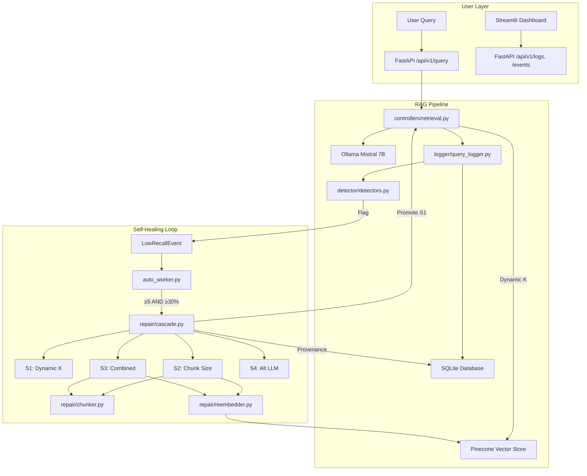
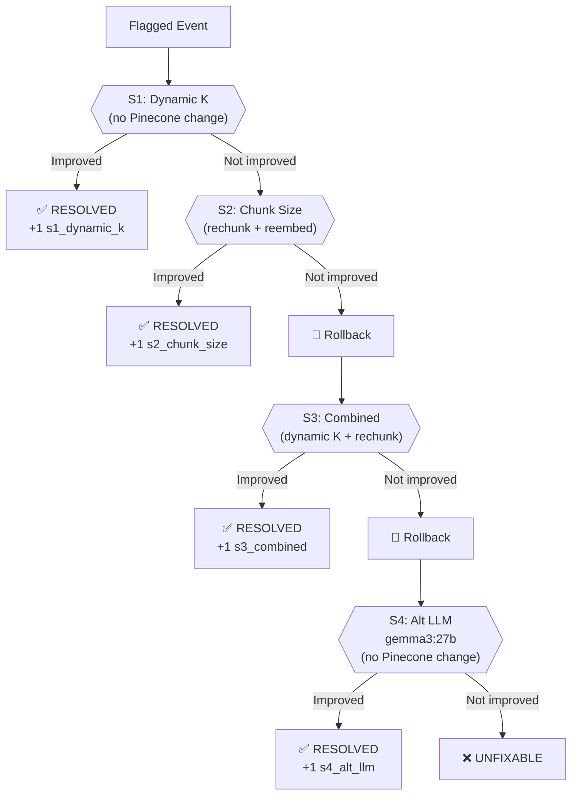
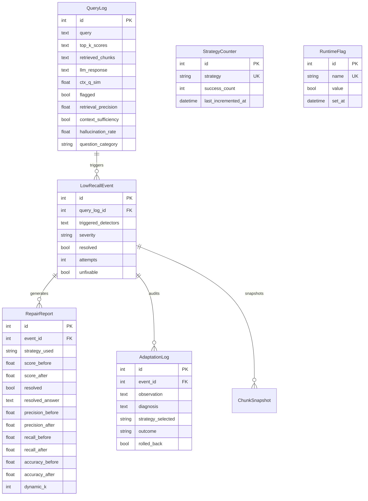

# Self-Organising RAG — Complete System Explanation

## Overview

This is a **self-healing Retrieval-Augmented Generation (RAG)** system that automatically detects, diagnoses, and repairs poor retrieval quality — without human intervention.

The system ingests documents into a Pinecone vector store, answers user questions using LLM + retrieved chunks, and **automatically monitors and repairs itself** when answer quality degrades.

It uses a **single-pass ordered cascade** of 4 repair strategies, with a promotion system that elevates successful strategies into the main query pipeline.

---

## Architecture Diagram



---

## System Components

### 1. Core RAG Pipeline

| File | Purpose |
|------|---------|
| `main.py` | FastAPI app entry point, initializes DB |
| `api/routes.py` | REST endpoints for query, ingest, repair, evaluation, strategy counters, runtime flags |
| `controllers/retrieval.py` | RAG answer generation: retrieve chunks → LLM answer (supports dynamic K) |
| `controllers/ingestion.py` | Document upload, text cleaning, variable chunking (500–1250 chars), Pinecone ingestion |
| `services/llm_factory.py` | Cached singletons: Ollama LLM, fallback LLM (gemma3:27b), embeddings, Pinecone index |
| `config.py` | Pydantic settings loaded from `.env` |

**How a query works:**
```
User → POST /api/v1/query → retrieval.answer_query()
  → _resolve_main_k(query)  // dynamic K if promoted, else 5
  → Pinecone similarity_search (k=dynamic)
  → LLM generates answer from top-K chunks
  → log_query() writes to SQLite
  → run_detectors() checks for quality issues (K-invariant)
  → Returns answer + scores to user
```

---

### 2. Ingestion Pipeline — Variable Chunk Sizing

**File:** `controllers/ingestion.py`

**Ingestion range:** Documents are split into chunks between 500 and 1250 characters. Empty documents (no extractable text) are detected early and return a warning without crashing.

| Parameter | Value | Purpose |
|-----------|-------|---------|
| **Max chunk size** | 1250 chars | Upper bound for `RecursiveCharacterTextSplitter` |
| **Min chunk size** | 500 chars | Enforced via `_enforce_min_chunk_size()` — tiny chunks are merged with neighbors |
| **Chunk overlap** | 200 chars | 16% overlap for context continuity |
| **Separators** | `\n\n → \n → . → ? → ! → ; → , → space` | Semantic hierarchy — splits at natural boundaries |

**Min-size enforcement algorithm:**
1. Buffer starts as the first chunk
2. For each subsequent chunk: if buffer < 500 chars → merge into buffer
3. After loop, if trailing buffer is still < 500 chars → merge backward with previous chunk

This guarantees every chunk is ≥ 500 chars, ensuring meaningful embeddings.

---

### 3. Stage 1: DETECT — Quality Monitoring

**File:** `detector/detectors.py`

Five independent detection rules run after every query. If any trigger, a `LowRecallEvent` is created:

| # | Rule | What it Detects | Threshold |
|---|------|----------------|-----------|
| 1 | `low_top_score` | Top-1 retrieval score too low | < 0.65 |
| 2 | `score_drop` | Largest adjacent-rank score gap | > 0.15 max adjacent gap |
| 3 | `llm_uncertainty` | LLM response contains hedging language | 50+ phrases |
| 4 | `semantic_mismatch` | Retrieved chunks are about different topics | pairwise sim < 0.70 |
| 5 | `evidence_mismatch` | LLM answer doesn't match the evidence | answer↔evidence sim < 0.60 |

> [!NOTE]
> Thresholds are calibrated for `mxbai-embed-large` which produces scores in the 0.55–0.85 range (higher than typical models).

**Severity levels:**
- 1 detector → `LOW`
- 2 detectors → `MEDIUM`
- 3+ detectors → `HIGH`

---

### 4. Stage 2: MEASURE — Metrics Collection

**File:** `controllers/metrics.py`

Four quality metrics computed per-query, all embedding-based (no extra LLM calls):

| Metric | Description | Method |
|--------|-------------|--------|
| `retrieval_precision` | Fraction of top-K chunks relevant to the answer | Cosine sim of each chunk to ground truth ≥ 0.50 |
| `context_sufficiency` | Whether context covers the full answer | Combined context ↔ ground truth sim ≥ 0.70 |
| `hallucination_rate` | Fraction of ungrounded claims in the answer | Each sentence ↔ best chunk sim < 0.55 = ungrounded |
| `question_category` | `short_factual` / `complex` / `cross_section` | **Embedding-based NLP classifier** (see below) |

**Question Classifier — Embedding-based (NLP):**

The classifier uses **prototype-based semantic similarity** instead of keyword matching:
- 30 prototype queries (10 per category) define what each category "looks like"
- Prototypes are embedded once on first call, then cached
- Incoming queries are embedded and compared via cosine similarity to each category's prototypes
- Category with highest mean similarity wins
- Falls back to keyword-based heuristic if embedding model is unavailable

---

### 5. Stage 3: DECIDE — Diagnosis

**File:** `detector/decision_engine.py`

The decision engine analyzes **which detectors fired** + **question category** + **metrics** to determine a root cause and recommend a chunk configuration:

| Root Cause | When | Strategy | Chunk Config |
|-----------|------|----------|-------------|
| `high_hallucination` | Hallucination rate > 0.3 | `tighten_chunks` | 200 / 40 |
| `chunk_too_large` | Short factual + low score | `reduce_chunk_size` | 350 / 70 |
| `cross_section_failure` | Cross-section + fragmented | `large_coherent_chunks` | 1700 / 300 |
| `chunk_too_small` | Complex + insufficient context | `increase_chunk_size` | 1400 / 250 |
| `stale_content` | Score drop + very low score | `re_ingest` | Keep current |
| `general_degradation` | Multiple triggers, no clear cause | `reduce_chunk_size` | 350 / 70 |

> [!NOTE]
> The decision engine's `diagnose()` function is used by the cascade (Strategies 2 and 3) to pick chunk size configs. The old `select_strategy()`, `check_cooldown()`, and `set_cooldown()` functions are **deprecated** — the cascade handles strategy ordering.

**Repair range:** The chunk size configs span 200–1700 chars, expanding beyond the ingestion baseline (500–1250) in both directions:

```
Repair shrink           Ingestion baseline            Repair grow
[200 ═══════ 500] [═══════ 500–1250 ═══════] [1250 ═══════ 1700]
  tighten(200)                                  increase(1400)
  reduce(350)                                   large(1700)
```

---

### 6. Stage 4: ACT — Ordered Repair Cascade

**File:** `repair/cascade.py`

The repair pipeline uses a **single-pass ordered cascade** of 4 strategies. Each event gets exactly ONE cascade pass — the first strategy that satisfies `_is_improved()` wins:



#### Strategy 1 — Dynamic K Selection (`s1_dynamic_k`)
- Classifies the query (`short_factual` / `complex` / `cross_section`)
- Selects K from category-specific ranges (2–10)
- Re-probes with the new K — **no Pinecone modification**
- Fast and safe — always tried first

#### Strategy 2 — Chunk Size Variation (`s2_chunk_size`)
- Uses `diagnose()` to pick the recommended chunk config
- Rechunks the failing chunks with the new size/overlap
- Calls `handle_event()` with `internal_rollback=False` — cascade owns rollback
- Probes before and after at K=5; win-decision uses **local baseline** (same K) to avoid K-bias
- If not improved → **rolls back** before continuing to S3

#### Strategy 3 — Combined (`s3_combined`)
- Dynamic K (from S1) **+** rechunking (from S2) applied together
- Calls `handle_event()` with `k_override=dynamic_k` and `internal_rollback=False`
- Probes before and after at the same dynamic K; local baseline comparison
- If not improved → **rolls back** before continuing to S4

#### Strategy 4 — Alternate LLM (`s4_alt_llm`)
- Same chunks, same K — swaps the LLM from Mistral (7B) to gemma3:27b (27B)
- **No Pinecone modification** — only changes the answer generation
- **Bypasses `_is_improved()`** — chunks are unchanged so score-delta is always 0. Instead uses custom win condition: `not _is_non_answer(fallback_answer)` (substantive answer = success)
- The larger model may extract answers the smaller model couldn't

> [!IMPORTANT]
> **Rollback guarantee:** Cascade — not `handle_event` — owns rollback. S2 and S3 call `handle_event(internal_rollback=False)`, get raw post-rechunk metrics, and either keep the chunks (break) or rollback the snapshot before the next strategy. S1 and S4 never touch Pinecone.

> [!NOTE]
> **Per-strategy local baselines:** Each strategy returns `metrics_before_local` probed at the SAME K as its `metrics_after`. The cascade uses this for win-decisions instead of the cascade-level baseline, preventing K-mismatches from biasing the comparison (e.g., S2 at K=5 vs cascade baseline at dynamic K=8).

---

### 7. Auto Worker — Cascade Trigger

**File:** `auto_worker.py`

A standalone daemon that monitors and triggers the repair cascade:

```
1. Poll database every 5 seconds
2. Count pending events (unresolved AND not unfixable)
3. Trigger when BOTH conditions met:
   - Pending count ≥ 5
   - Pending / total queries ≥ 30%
4. Process ALL pending events (not just first 5):
   → run_repair_cascade(event.id) for each
5. Print batch summary (resolved / unfixable / errors)
6. Return to monitoring mode
```

**Key differences from the old worker:**
- No per-event retry loop — single pass only
- No cooldowns — each event gets exactly one cascade
- No `MAX_ATTEMPTS` — unfixable is the terminal state
- Processes ALL pending events to prevent queue starvation

---

### 8. Dynamic K Selection

**File:** `repair/orchestrator.py`

Instead of fixed K=5 for all queries, the system dynamically selects K based on:

| Question Category | K Range | Rationale |
|-------------------|---------|-----------|
| `short_factual` | 2–4 | Precise, focused retrieval |
| `complex` | 5–8 | Need more context |
| `cross_section` | 6–10 | Spanning multiple topics |

**Score cliff detection:** If there's a > 0.12 gap between consecutive chunk scores, cut at the cliff (lower chunks are noise).

**Promotion:** After S1 (dynamic K) resolves 5 events successfully, it is permanently promoted to the main query pipeline. All future queries use dynamic K instead of hardcoded K=5.

**Probe consistency:** After promotion, `_probe_metrics()` receives `k` explicitly and passes it through to `generate_answer_only(query, namespace, k=k)`. This ensures the answer in the metrics dict is generated from the **same chunks** that precision/recall were measured against — not from whatever K `_resolve_main_k()` would return independently.

---

### 9. Strategy Counters & Promotion

**Files:** `repair/cascade.py`, `db/models.py`, `controllers/retrieval.py`

The cascade tracks success counts per strategy:

| Counter | Incremented When |
|---------|-----------------|
| `s1_dynamic_k` | Strategy 1 resolves an event |
| `s2_chunk_size` | Strategy 2 resolves an event |
| `s3_combined` | Strategy 3 resolves an event |
| `s4_alt_llm` | Strategy 4 resolves an event |

**Promotion logic (Strategy 1 only):**
1. When `s1_dynamic_k.success_count ≥ 5` → set `RuntimeFlag("dynamic_k_promoted")` to True
2. `controllers/retrieval.py` reads this flag on every request via `_resolve_main_k()`
3. If promoted → classify query → return dynamic K
4. If not promoted → return K=5 (unchanged behavior)
5. Cascade skips S1 for future events (it's already in the main pipeline)

> [!NOTE]
> Promotion is **one-way** — once set, it never reverts. Only S1 is eligible for promotion.

---

### 10. Non-Answer Detection

**File:** `repair/orchestrator.py`

A critical guard that prevents marking "resolved" when the LLM actually said "I don't know":

**Logic:** If the chunk has the answer → LLM answers directly, no hedging. Any hedging phrase = the answer isn't in the chunks = non-answer.

Detected phrases: `"does not provide information"`, `"does not mention"`, `"i don't know"`, `"cannot determine the answer"`, etc.

---

### 11. Safety: Rollback & Provenance

#### Rollback (`repair/reembedder.py`)
Before any chunk deletion, a `ChunkSnapshot` is saved to SQLite. If repair fails:
1. Delete the new chunks that were inserted
2. Load old chunks from snapshot
3. Re-embed and upsert back to Pinecone
4. Clean up snapshot entries

#### Provenance
**Ground truths:** `_get_ground_truths_for_query()` now returns `[]` unconditionally. The old behavior returned the previous LLM answer as a "ground truth", which was wrong — comparing repair results against the bad answer that triggered the flag produced meaningless metrics. Win-decisions now rely on retrieval scores and non-answer detection.

Every cascade run writes two records:
- **RepairReport**: score before/after, strategy that won (or "none"), resolved answer
- **AdaptationLog**: full audit trail — observation (including cascade steps) → diagnosis → strategy → outcome

---

### 12. Dashboard

**File:** `dashboard/app.py`

Streamlit dashboard with 4 pages:

| Page | What it Shows |
|------|--------------|
| **Overview** | Total queries, healthy, flagged, resolved counts. Score trends over time. |
| **Query Diagnostics** | Per-query detail: scores, chunks, LLM response. Query inspector. |
| **Flagged Events** | Expandable event cards with repair strategy explanation, chunks before/after, resolved answer. |
| **Adaptation Log** | Full provenance timeline of every cascade run. |

---

## Database Schema



---

## API Endpoints

| Method | Endpoint | Purpose |
|--------|----------|---------|
| `POST` | `/api/v1/ingest` | Upload and ingest a document (PDF, DOCX, TXT) |
| `POST` | `/api/v1/query` | Ask a question (RAG pipeline) |
| `POST` | `/api/v1/evaluate` | Evaluate a question against ground truth |
| `POST` | `/api/v1/repair/{event_id}` | Trigger repair cascade for a specific event |
| `GET` | `/api/v1/logs` | Query logs with scores and flagging status |
| `GET` | `/api/v1/events` | List LowRecallEvents |
| `GET` | `/api/v1/repair-report/{event_id}` | Repair report + diagnosis for an event |
| `GET` | `/api/v1/strategy-counters` | Strategy success counts for the cascade |
| `GET` | `/api/v1/runtime-flags` | Runtime flags (e.g., dynamic K promotion) |
| `GET` | `/api/v1/adaptation-log` | Full adaptation provenance trail |
| `GET` | `/api/v1/pipeline-config` | Current chunking configuration |
| `GET` | `/api/v1/eval-history` | Evaluation snapshot history |

---

## Technology Stack

| Component | Technology |
|-----------|-----------|
| **Backend** | FastAPI (Python) |
| **LLM (Primary)** | Ollama — Mistral 7B |
| **LLM (Fallback)** | Ollama — Gemma3 27B |
| **Embeddings** | Ollama — mxbai-embed-large (1024 dims) |
| **Vector Store** | Pinecone |
| **Database** | SQLite (via SQLAlchemy) |
| **Dashboard** | Streamlit |
| **Orchestration** | LangChain |

---

## Bugs Discovered & Fixed

### Bug 1: Probe Answer/Chunk K Mismatch (Critical — Post-Promotion)
**Where:** `repair/orchestrator.py` → `_probe_metrics()`, `controllers/retrieval.py` → `generate_answer_only()`

**Problem:** `_probe_metrics()` measured chunks/precision/recall at the K it was called with, but called `generate_answer_only(query)` which used `_resolve_main_k()` — returning a *different* K after promotion. The answer in the metrics dict came from different chunks than the ones measured.

**Fix:** `generate_answer_only()` now accepts optional `k` parameter. `_probe_metrics()` passes `k` explicitly so answer generation uses the same K as chunk retrieval.

---

### Bug 2: Ground Truth Returns Old Bad Answer
**Where:** `repair/orchestrator.py` → `_get_ground_truths_for_query()`

**Problem:** Returned `[log.llm_response]` (the old bad answer) as "ground truth" when `answer_sem_sim` was populated. Precision/recall computed against this were meaningless — they measured "did the repair match the bad answer?"

**Fix:** Now returns `[]` unconditionally. Win-decisions rely on retrieval scores and non-answer detection.

---

### Bug 3: Score Drop Detector Sensitive to K
**Where:** `detector/detectors.py` → Rule 2 (`score_drop`)

**Problem:** Used `scores[0] - scores[-1]` (rank-1 minus rank-K). At K=2 (short_factual after promotion), only 2 scores — drop becomes less meaningful. At K=10, wider spread.

**Fix:** Changed to **max adjacent gap**: `max(scores[i] - scores[i+1])`. K-invariant — detects the same cliff regardless of how many chunks were retrieved.

---

### Bug 4: Cascade Baseline K Mismatch
**Where:** `repair/cascade.py` → `run_repair_cascade()`

**Problem:** Cascade always baselined at K=5, but post-promotion the user experienced dynamic K. The "before" metrics didn't match what the user actually saw.

**Fix:** Cascade baseline now uses `_resolve_main_k(query)`. Each strategy also returns `metrics_before_local` probed at its own K, and the cascade uses that for win-decisions instead of the cascade-level baseline.

---

### Bug 5: Empty Ingestion Crash
**Where:** `controllers/ingestion.py`

**Problem:** `min(sizes)` and `sum(sizes)//len(sizes)` crash on empty PDFs/TXT files.

**Fix:** Guard `if not sizes: return warning`.

---

### Pre-existing (Not Fixed — Low Impact)

| # | Issue | Impact |
|---|-------|--------|
| `QueryLog.chunk_ids` | Stores source filenames, not Pinecone IDs | Harmless — repair does fresh lookups |
| `_resolve_main_k` per-query DB hit | Opens SQLite session per query (~1ms) | Could cache with TTL |
| `answer_query` double Pinecone call | `similarity_search_with_score` + retrieval chain | Could fold scoring into chain |
| Snapshot rows on success | S2/S3 snapshots persist after resolve | Harmless — forensic audit trail |

---

## End-to-End Flow Example

```
1. User asks: "What date did Martin Luther nail the 95 Theses?"

2. RETRIEVE: _resolve_main_k() → k=3 (short_factual, if promoted) or k=5
   → Pinecone returns chunks (score 0.78)
   → Chunks discuss Luther's writings in Dec 1521, but NOT the nailing date

3. GENERATE: Mistral says "The text does not provide this information"

4. DETECT: llm_uncertainty + evidence_mismatch triggers → LowRecallEvent created
   (score_drop uses max adjacent gap — K-invariant)

5. AUTO-WORKER: Accumulates to ≥5 pending AND ≥30% ratio → cascade starts

6. CASCADE: run_repair_cascade(event_id)
   Baseline: _resolve_main_k() → K=5 (pre-promotion) or K=3 (post-promotion)
   
   S1 — Dynamic K:
   → classify: "short_factual" → K=3
   → probe at K=3 (answer generated at same K=3) → NOT RESOLVED
   
   S2 — Chunk Size:
   → diagnose: general_degradation → reduce_chunk_size (350/70)
   → handle_event(internal_rollback=False, k_override=5)
   → local baseline at K=5, probe at K=5 → NOT RESOLVED
   → CASCADE ROLLBACK
   
   S3 — Combined:
   → handle_event(internal_rollback=False, k_override=3)
   → local baseline at K=3, probe at K=3 → NOT RESOLVED
   → CASCADE ROLLBACK
   
   S4 — Alt LLM (gemma3:27b):
   → same chunks → skip_improve_check=True
   → gemma3:27b → _is_non_answer() check → still non-answer → win=False
   
   Result: UNFIXABLE ❌ (the date literally isn't in any chunk)

7. PROVENANCE: RepairReport(strategy_used="none") + AdaptationLog written
```

> [!TIP]
> If the answer genuinely doesn't exist in the ingested documents, no repair strategy can fix it. The system correctly identifies this by exhausting all 4 strategies in a single pass and marking the event as `unfixable`.
